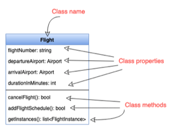
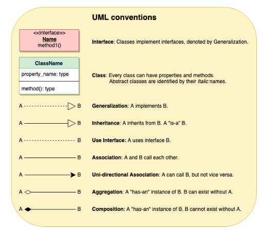

# Unified Modeling Language (UML)

###### UML Definition

- Used to model the Object-Oriented Analysis of a software system.
- A way of visualizing and documenting a software system by using a collection of diagrams.
- It helps engineers, businesspeople and system architects understand the behaviour and structure of system being designed.

###### Benefits of using UML

- Helps develop a quick understanding of a software system.
- UML modeling helps in breaking a complex system into discrete pieces that can be easily understood.
- UML's graphical notatioins can be used to communicate design decisions.
- As UML is independent of any specific platform or language or technology, its easier to abstract out concepts.
- Becomes easier to hand over the system to new team.

###### Types of UML Diagrams

- Current UML standard has 14 different kinds of diagrams.
- [Structural UML Diagrams:]() These diagrams analyze and depict the structure of a system or process.
  - *Class Diagram*
  - *Object Diagram*
  - *Package Diagram*
  - *Component Diagram*
  - *Composite Structure Diagram*
  - *Deployment Diagram*
  - *Profile Diagram*
- [Behavioural UML Diagrams:]() These diagrams describe the bevaviour of the system, its actors and its building components.
  - *Use Case Diagram*
  - *Activity Diagram*
  - *Sequence Diagram*
  - *State Diagram*
  - *Communication Diagram*
  - *Interaction Overview Diagram*
  - *Timing Diagram*

###### Important UML Diagrams to be discussed

- **Use Case Diagram:** Used to describe a set of user scenarios, it illustrates the functionality provided by the system.
- **Class Diagram:** Used to describe structure and behaviour in the use cases, provides a conceptual model of the system in terms of entities and their relationships.
- **Activity Diagram:** Used to model the functional flow-of-control b/w two or more class objects.
- **Sequence Diagram:** Used to describe interactions among classes in terms of an exchange of messages over time.

 

 

## Use Case Diagrams

###### Use Case Diagrams Definition

- Use case diagrams describe a **set of actions (called use cases)** that a system should or can perform in collaboration with one or more **external users of the system (called actors)**.
- Each use case should provide some observable and valuable results to the actors

###### Functionality of Use Case Diagrams

- It describes the high-level functional behaviour of the system.
- It answer what system does from the user point of view.
- It tells "What will the system do?" and "What it will not do?".

 ###### Use Case Definition

- A use case illustrates a unit of functionality provided by the system.
- Primary purpose of the use case diagrams is to help development teams visualize the functional requirements of a system.
- It also includes relationship of actors to the essential processes, as well as relationship among different use cases.

> **Drawing a Use Case Diagram:**

- To illustrate a use case on the diagram, draw an oval and put the name of use case in the oval.
- To show an actor (user of the system) on the diagram, draw a stick figure to the left or right of diagram.

 

###### Different Components of Use Case Diagram

- **System Boundary:**
  - Defines the scope and limits of the system.
  - Shown as rectangle that spans all use cases of the system.
- **Actors:**
  - An actor is an entity that performs specific actions.
  - The roles are actual business roles of the users in a given system.
  - An actor interacts with a use case of the system. 
  - *Example:- Banking System* - Customer is one actor, employee is another actor etc.
- **Use Case:** 
  - Every business functionality is a potential use case.
  - The use case should list the discrete business functionality specified in the problem statement.
- **Include Relationship:**
  - Represents an invocation of one use case by another use case.
  - From coding perspective its like one function being called by another function.
- **Extend Relationship:**
  - Signifies that the extended use case will work exactly like base use case with some added steps.

 

## Class Diagram

###### Class Diagram Definition

- It is a structural UML diagarma and is the backbone of object oriented modeling.
- It shows how different entities (people, things and data) relate to each other.
- It describes the attributes and operations of a class and also the constraints imposed on the system.
- Widely used in the modeling of object-oriented systems because they are the only UML diagrams that can be directly mapped  to code.

###### Purpose of Class Diagram

- Analysis and design of the static view of an application
- To describe the responsibilites of the system
- To provide a base for component and deployment diagrams
- Forward and Reverse Engineering

###### Depiction of Class in Class Diagram

- A class is depicted with three horizontal sections in a class diagram.
  1. **Upper Section:**  Name of Class 
  2. **Middle Section:** Properties of the Class
  3. **Lower Section:**  Operations (Methods) on Class

###### Relationship b/w Classes

[`1. Association`]() 

- If two classes need to communicate with each other there must be a link b/w them and this link is represented by association.
- Associations can be represented in a class diagram by a line b/w these classes with an arrow indicating the navigation direction.
- By default, associations are always **bi-directional**, that means both classes are aware of each other and their relationship.
  - *Example:* Association b/w Pilot and FlightInstance
- In **uni-directional** association, two classed are related but only once class knows that the relationship exists.
  - *Example:* Only flight class knows about Aircraft

 

[`2. Multiplicity`]()

- Multiplicity indicates how many instances of a class participate in the relationship.
- It is a constraint that specifies the range of permiited cardinalities b/w two classes.
- A ranged multiplicity can be expressed as **`0....*`**  which means "zero to many" or as **`2....4`** which means "two to four".
- We can indicate the multiplicity of an association by adding multiplicity adornments to the line denoting the association.
  - *Example:* In the diagram below one FlightInstance will have two Pilots, while a Pilot can have many FlightInstances.

 

[`3. Aggregation`]()

- Aggregation is a special type of association used to model a **"whole to its parts"** relationship.
- Aggregation implies a relationship where the **`Child class` *can exist independently of the* `Parent class`**.
  - *Example:* Aircraft can exist without Airline.

 

[`4. Composition`]()

- Composition relationship is just another form of aggregation relationship.
- In this **`Child class` *is dependent on the* `Parent class`** .
- **`Child class` *can not exist indepenedtly of the* `Parent class`**.
  - *Example:* WeeklySchedule is composed in Flight and when Flight lifecycle ends, WeekSchedule automatically gets destroyed.

 

[`5. Generalization`]()

- It is the ***mechanism for combining similar objects into a single, more general class***.
- It identifies commonalities among a set of entities .
  - *Example:* Crew, Pilot and Admin all are Person.

 

[`6. Dependency`]()

- It is a relationship in which one class the **`Client class` *uses or depends on another class*  `Supplier class`**.
  - *Example:* FlightReservation depends on Payment.

 

[`7. Abstract Class`]()

- An abstract class is identified by specifying its name in *italics*.
  - *Example:* Person and Account classes are abstract.

 

## Sequence Diagram

###### Sequence Diagram Definition

- Describe interactions among classes in terms of an exchange of messges over time.
- It is used to explore the logic of complex operations, functions or procedures.
- The sequence of interactions b/w the objects is represented in a step-by-step manner.
- Sequence diagram shows a detailed flow for a specific use case or even just part of a particular use case.
- They are almost self explanatory and show the calls b/w the different objects in their sequence.
- They can also explain at a detailed level different calls to various objects.

###### Depiction of Sequence Diagram

- A sequence diagram has 2 dimensions vertical and horizontal.
- **Vertical dimension** shows the sequence of messages in the chronological order thay they occur.
- **Horizontal dimension** shows the object instances to which the messages are sent.

###### Drawing Sequence Diagram

- At the top of the diagram - identify the class instances (objects) by putting each class instance inside a box (see above).
- If a class instance sends a message to another class instance, draw a line with an open arrowhead pointing to the receiveing class instance and place the name of the message above the line.
- Optionally for important messages, we can draw a dotted line with an arrowhead pointing back to the originating class instance and label the returned value above the dotted line.

 

## Activity Diagrams

###### Activity Diagram Definition

- Activity diagrams are used to illustrate the flow of control in system.
- An activity diagram shows the flow of control for a system functionality.
- It emphasizes the condition of flow and the sequence in which it happens.
- We can also use an activity diagram to refer to the steps involved in the execution of a use case.

###### Purose of Activity Diagrams

- It illustrate the dynamic nature of a system by modeling the flow of control from activity to activity.
- An activity represents an operation on some class in the system that results in a change in the state of the system.
- Typically activity diagrams are used to model workflow or business processes and internal operations.

 

 

###### Difference b/w Activity Diagram and Sequence Diagram

- **Activity Diagram:** 
  - Captures the process workflow and is used for [funtional modeling]().
  - [Functional model]() represents the flow of values from external inputs through operations & internal data stores to external outputs.
- **Sequence Diagram:**
  - Tracks the interaction b/w the objects and is used for [dynamic modeling]().
  - Dynamic Modeling is represented by tracking states, transition b/w states and the events that trigger these transitions.

 

 

----

<a href="low-level-design-basics" class="prev-button">&larr; Previous: Low Level Design Basics</a>

