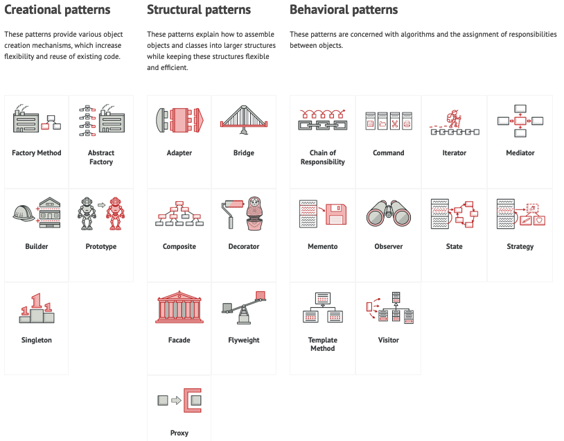

# Design Patterns Introduction

###### What are design patterns ?

**Design patterns** are typical solutions to commonly  occurring problems in software design.

They are like pre-made blueprints that we can customize to solve a recurring design problem in our  code.

We can’t just find a pattern and copy it into our program, the way  we can with off-the-shelf functions or libraries.

The pattern is not a  specific piece of code, but a general concept for solving a particular  problem.

We can follow the pattern details and implement a solution  that suits the realities of our own program.

###### What does the pattern consist of ?

Most patterns are described very formally so people can reproduce  them in many contexts.

Here are the sections that are usually present in a pattern description:

-  **Intent** of the pattern briefly describes both the problem and the solution.
-  **Motivation** further explains the problem and the solution the pattern makes possible.
-  **Structure** of classes shows each part of the pattern and how they are related.
-  **Code example** in one of the popular programming languages makes it easier to grasp the idea behind the pattern.

Some pattern catalogs list other useful details, such as  applicability of the pattern, implementation steps and relations with  other patterns.

###### Why to learn patterns ?

- Design patterns are a toolkit of **tried and tested solutions** to common problems in software design.
- Even if we never encounter these problems, knowing patterns is still useful coz it teaches to solve all sorts of problems using principles of object-oriented  design.
- We might manage to work as a programmer for many  years without knowing about a single pattern. Even in that case, though, we might be implementing some patterns without even knowing it.

###### Criticism of Patterns

- **Kludges for a weak programming language: ** 
  - Usually the need for patterns arises when people choose a programming language or a technology that lacks the necessary level of abstraction. In this case, patterns become a kludge that gives the language much-needed super-abilities.
  - Example:- [Strategy pattern]() can be implemented with a simple anonymous (lambda) function in most modern languages.

- **Inefficient solutions**
  - Patterns try to systematize approaches that are already widely used. This unification is viewed by many as a dogma and they implement  patterns “to the point”, without adapting them to the context of their  project.
- **Unjustified use**
  - If all you have is a hammer, everything looks like a nail.
  - Novices having learned about patterns, try to apply them everywhere, even in situations where simpler code would do just fine.

#### Patterns Classification:

- Design patterns differ by their complexity, level of detail and scale of applicability to the entire system being designed. 

- In analogy to road construction: we can make an intersection safer by  either installing some traffic lights or building an entire multi-level  interchange with underground passages for pedestrians.

- The most basic and low-level patterns are often called [*idioms*]() and usually apply only to a single programming language.

- The most universal and high-level patterns are [*architectural patterns*](). Developers can implement these patterns in virtually any language.  Unlike other patterns, they can be used to design the architecture of an entire application.

  

> ###### All patterns can be categorized by their *intent*, or purpose. There are 3 main groups of patterns:

