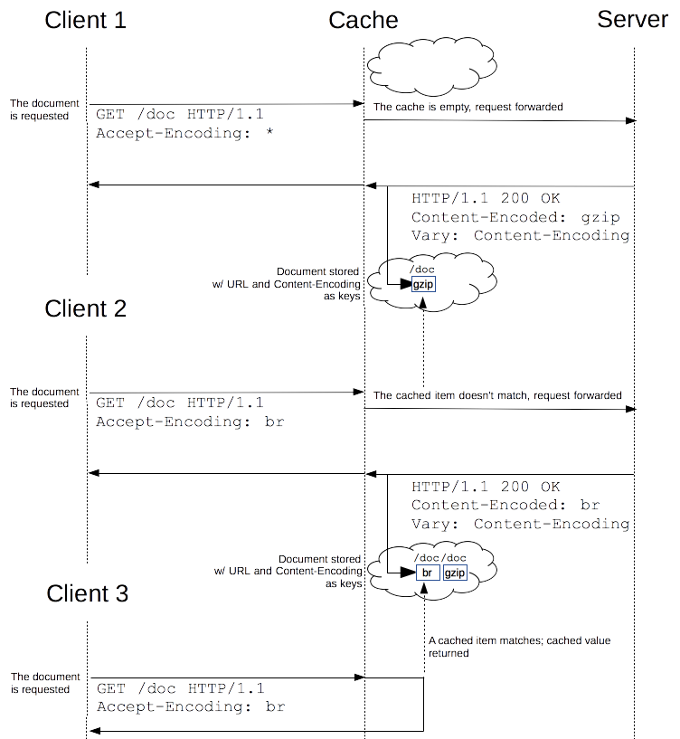

## HTTP Caching  
- The performance of web sites and applications can be significantly improved by reusing previously fetched resources. 
- Web caches reduce latency and network traffic and thus lessen the time needed to display a representation of a resource. 
- By making use of HTTP caching, Web sites become more responsive.

### Different kinds of caches
- Caching is a technique that stores a copy of a given resource and serves it back when requested. When a web cache has a requested resource in its store, it intercepts the request and returns its copy instead of re-downloading from the originating server. This achieves several goals: it eases the load of the server that doesn’t need to serve all clients itself, and it improves performance by being closer to the client, i.e., it takes less time to transmit the resource back. For a web site, it is a major component in achieving high performance. On the other side, it has to be configured properly as not all resources stay identical forever: it is important to cache a resource only until it changes, not longer.
- There are several kinds of caches: these can be grouped into two main categories: private or shared caches. A shared cache is a cache that stores responses for reuse by more than one user. A private cache is dedicated to a single user. This page will mostly talk about browser and proxy caches, but there are also gateway caches, CDN, reverse proxy caches and load balancers that are deployed on web servers for better reliability, performance and scaling of web sites and web applications.

- 

### Private browser caches
- A private cache is dedicated to a single user. You might have seen "caching" in your browser's settings already. A browser cache holds all documents downloaded via HTTP by the user. This cache is used to make visited documents available for back/forward navigation, saving, viewing-as-source, etc. without requiring an additional trip to the server. It likewise improves offline browsing of cached content.

### Shared proxy caches
- A shared cache is a cache that stores responses to be reused by more than one user. For example, an ISP or your company might have set up a web proxy as part of its local network infrastructure to serve many users so that popular resources are reused a number of times, reducing network traffic and latency.

### Targets of caching operations
- HTTP caching is optional, but reusing a cached resource is usually desirable. 
- However, common HTTP caches are typically limited to caching responses to GET and may decline other methods. 
- The primary cache key consists of the request method and target URI (oftentimes only the URI is used as only GET requests are caching targets). 
- Common forms of caching entries are:
    - Successful results of a retrieval request: a 200 (OK) response to a GET request containing a resource like HTML documents, images or files.
    - Permanent redirects: a 301 (Moved Permanently) response.
    - Error responses: a 404 (Not Found) result page.
    - Incomplete results: a 206 (Partial Content) response.
    - Responses other than GET if something suitable for use as a cache key is defined.
- A cache entry might also consist of multiple stored responses differentiated by a secondary key, if the request is target of content negotiation.

### Controlling caching
#### The Cache-control header
- The Cache-Control HTTP/1.1 general-header field is used to specify directives for caching mechanisms in both requests and responses. Use this header to define your caching policies with the variety of directives it provides.
#### No caching
- The cache should not store anything about the client request or server response. A request is sent to the server and a full response is downloaded each and every time.
~~~text
Cache-Control: no-store
~~~
#### Cache but revalidate
- A cache will send the request to the origin server for validation before releasing a cached copy.
~~~text
Cache-Control: no-cache
~~~
#### Private and public caches
- The "public" directive indicates that the response may be cached by any cache. This can be useful, if pages with HTTP authentication or response status codes that aren't normally cacheable, should now be cached.
- On the other hand, "private" indicates that the response is intended for a single user only and must not be stored by a shared cache. A private browser cache may store the response in this case.
~~~text
Cache-Control: private
Cache-Control: public
~~~
#### Expiration
- The most important directive here is "max-age=<seconds>" which is the maximum amount of time a resource will be considered fresh. Contrary to Expires, this directive is relative to the time of the request. For the files in the application that will not change, you can usually add aggressive caching. This includes static files such as images, CSS files and JavaScript files, for example.
- For more details, see also the Freshness section below.
~~~text
Cache-Control: max-age=31536000
~~~
#### Validation
- When using the "must-revalidate" directive, the cache must verify the status of the stale resources before using it and expired ones should not be used. For more details, see the Validation section below.
~~~text 
Cache-Control: must-revalidate
~~~
#### The Pragma header
- Pragma is a HTTP/1.0 header, it is not specified for HTTP responses and is therefore not a reliable replacement for the general HTTP/1.1 Cache-Control header, although it does behave the same as Cache-Control: no-cache, if the Cache-Control header field is omitted in a request. Use Pragma only for backwards compatibility with HTTP/1.0 clients. 

### Freshness
- Once a resource is stored in a cache, it could theoretically be served by the cache forever. Caches have finite storage so items are periodically removed from storage. This process is called cache eviction. On the other side, some resources may change on the server so the cache should be updated. As HTTP is a client-server protocol, servers can't contact caches and clients when a resource changes; they have to communicate an expiration time for the resource. Before this expiration time, the resource is fresh; after the expiration time, the resource is stale. Eviction algorithms often privilege fresh resources over stale resources. Note that a stale resource is not evicted or ignored; when the cache receives a request for a stale resource, it forwards this request with a If-None-Match to check if it is in fact still fresh. If so, the server returns a 304 (Not Modified) header without sending the body of the requested resource, saving some bandwidth.
- Here is an example of this process with a shared cache proxy:
- 
- The freshness lifetime is calculated based on several headers. If a "Cache-control: max-age=N" header is specified, then the freshness lifetime is equal to N. If this header is not present, which is very often the case, it is checked if an Expires header is present. If an Expires header exists, then its value minus the value of the Date header determines the freshness lifetime. Finally, if neither header is present, look for a Last-Modified header. If this header is present, then the cache's freshness lifetime is equal to the value of the Date header minus the value of the Last-modified header divided by 10.
- The expiration time is computed as follows:
~~~text 
expirationTime = responseTime + freshnessLifetime - currentAge
~~~
- where responseTime is the time at which the response was received according to the browser.

### Revved resources
- The more we use cached resources, the better the responsiveness and the performance of a Web site will be. To optimize this, good practices recommend to set expiration times as far in the future as possible. This is possible on resources that are regularly updated, or often, but is problematic for resources that are rarely and infrequently updated. They are the resources that would benefit the most from caching resources, yet this makes them very difficult to update. This is typical of the technical resources included and linked from each Web pages: JavaScript and CSS files change infrequently, but when they change you want them to be updated quickly.
- Web developers invented a technique that Steve Souders called revving[1]. Infrequently updated files are named in specific way: in their URL, usually in the filename, a revision (or version) number is added. That way each new revision of this resource is considered as a resource on its own that never changes and that can have an expiration time very far in the future, usually one year or even more. In order to have the new versions, all the links to them must be changed, that is the drawback of this method: additional complexity that is usually taken care of by the tool chain used by Web developers. When the infrequently variable resources change they induce an additional change to often variable resources. When these are read, the new versions of the others are also read.
- This technique has an additional benefit: updating two cached resources at the same time will not lead to the situation where the out-dated version of one resource is used in combination with the new version of the other one. This is very important when web sites have CSS stylesheets or JS scripts that have mutual dependencies, i.e., they depend on each other because they refer to the same HTML elements.
- 
-The revision version added to revved resources doesn't need to be a classical revision string like 1.1.3, or even a monotonously growing suite of number. It can be anything that prevent collisions, like a hash or a date.

Cache validation
- When a cached document's expiration time has been reached, it is either validated or fetched again. Validation can only occur if the server provided either a strong validator or a weak validator.
- Revalidation is triggered when the user presses the reload button. It is also triggered under normal browsing if the cached response includes the "Cache-control: must-revalidate" header. Another factor is the cache validation preferences in the Advanced->Cache preferences panel. There is an option to force a validation each time a document is loaded.
- ETags
    - The ETag response header is an opaque-to-the-useragent value that can be used as a strong validator. That means that a HTTP user-agent, such as the browser, does not know what this string represents and can't predict what its value would be. If the ETag header was part of the response for a resource, the client can issue an If-None-Match in the header of future requests – in order to validate the cached resource.
    - The Last-Modified response header can be used as a weak validator. It is considered weak because it only has 1-second resolution. If the Last-Modified header is present in a response, then the client can issue an If-Modified-Since request header to validate the cached document.
    - When a validation request is made, the server can either ignore the validation request and response with a normal 200 OK, or it can return 304 Not Modified (with an empty body) to instruct the browser to use its cached copy. The latter response can also include headers that update the expiration time of the cached document.
    
### Varying responses
- The Vary HTTP response header determines how to match future request headers to decide whether a cached response can be used rather than requesting a fresh one from the origin server.
- When a cache receives a request that can be satisfied by a cached response that has a Vary header field, it must not use that cached response unless all header fields as nominated by the Vary header match in both the original (cached) request and the new request.    
- 
- This can be useful for serving content dynamically, for example. When using the Vary: User-Agent header, caching servers should consider the user agent when deciding whether to serve the page from cache. If you are serving different content to mobile users, it can help you to avoid that a cache may mistakenly serve a desktop version of your site to your mobile users. In addition, it can help Google and other search engines to discover the mobile version of a page, and might also tell them that no Cloaking is intended.
~~~text
Vary: User-Agent
~~~
- Because the User-Agent header value is different ("varies") for mobile and desktop clients, caches will not be used to serve mobile content mistakenly to desktop users or vice versa.

### References
- https://developers.google.com/web/fundamentals/performance/optimizing-content-efficiency/http-caching
- https://developer.mozilla.org/en-US/docs/Web/HTTP/Cookies
- https://www.mnot.net/cache_docs/ 