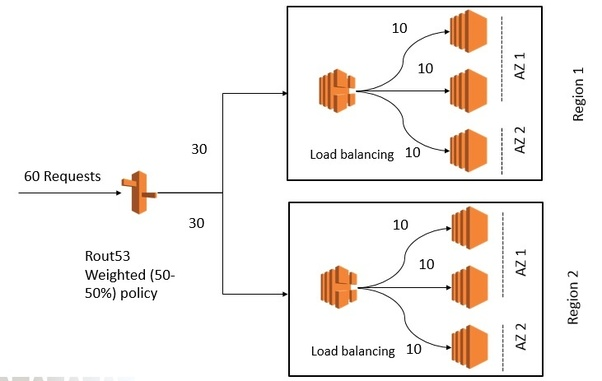

## AWS multi-region load balancing
- Load balancers are regional service i.e. they operate within an AWS region.
- Route 53 is global service i.e. they operate independent of region.
- Route 53 has routing policy to route requests to different endpoints which are in different region.
- OOO
- 
- OOO 
- Simply using ELB/ALB you won’t be able to distribute traffic between two regions. 
    - But combine it with Route 53 and you will be able to do so. 
    - Your solution will leverage Route53’s routing policy (Weighted ) to direct your request to load balancers created in different regions. 
    - Those load balancers will distribute traffic to the listeners registered to them in different AZs.
