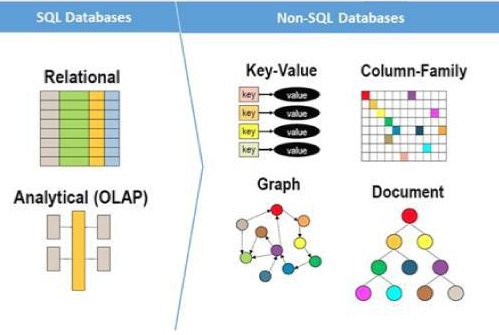

## SQL v/s NoSQL database
-  
### Data structure
- The first and primary factor in making the SQL vs NoSQL decision is what your data looks like.
- Why SQL 
    - If your data is primarily structured, a SQL database is likely the right choice.
    - A SQL database is a great fit for transaction-oriented systems such as customer relationship management tools, accounting software, and e-commerce platforms. 
    - Each row in a SQL database is a distinct entity (e.g. a customer), and each column is an attribute that describes that entity (e.g. address, job title, item purchased, etc.).
    - Because of these distinct, structured relationships between rows and columns in a table, SQL databases are best when you need ACID compliance. 
    - ACID stands for:
        - Atomicity – each transaction either succeeds completely or is fully rolled back.
        - Consistency – data written to a database must be valid according to all defined rules.
        - Isolation – When transactions are run concurrently, they do not contend with each other, and act as if they were being run sequentially.
        - Durability – Once a transaction has been committed to the database, it is considered permanent, even in the event of a system failure.
    - ACID compliance protects the integrity of your data by defining exactly what a transaction is and how it interacts with your database. It avoids database tables from becoming out-of-sync, which is super important for financial transactions. ACID compliance guarantees validity of transactions even in the face of errors, technology failures, disastrous events, and more.
    - If your data is very structured and ACID compliance is a must, SQL is a great choice.
- Why NoSQL 
    - If your data requirements aren’t clear or if your data is unstructured, NoSQL may be your best bet.
    - The data you store in a NoSQL database does not need a predefined schema like you do for a SQL database. 
    - The data can be column stores, document-oriented, graph-based, or key-value pairs. 
    - This provides much more flexibility and less upfront planning when managing your database.
    - With NoSQL, you can:
        - Create documents without carefully defining their structure upfront
        - Add fields to your database without changing the fields of existing documents
        - Store documents that have their own unique structure
        - Have multiple databases with different structures and syntax   
    - A NoSQL database is a much better fit to store data like article content, social media posts, sensor data, and other types of unstructured data that won’t fit neatly into a table. 
    - NoSQL databases were built with flexibility and scalability in mind, and follows the BASE consistency model, which means: 
        - Basic Availability
            - This means that while the database guarantees the availability of the data, 
            - the database may fail to obtain the requested data or the data may be in a changing or inconsistent state.
        - Soft state
            - The state of the database can be changing over time.
        - Eventual consistency
            - The database will eventually become consistent, and data will propagate everywhere at some point in the future.            