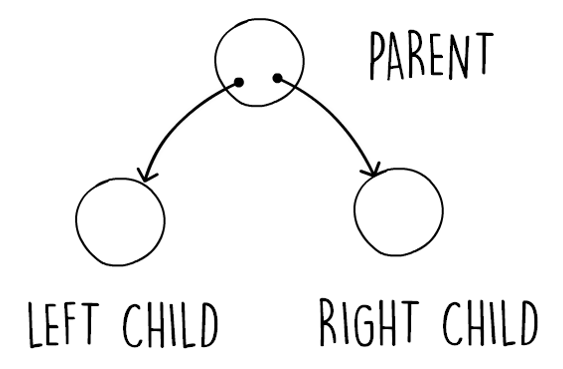
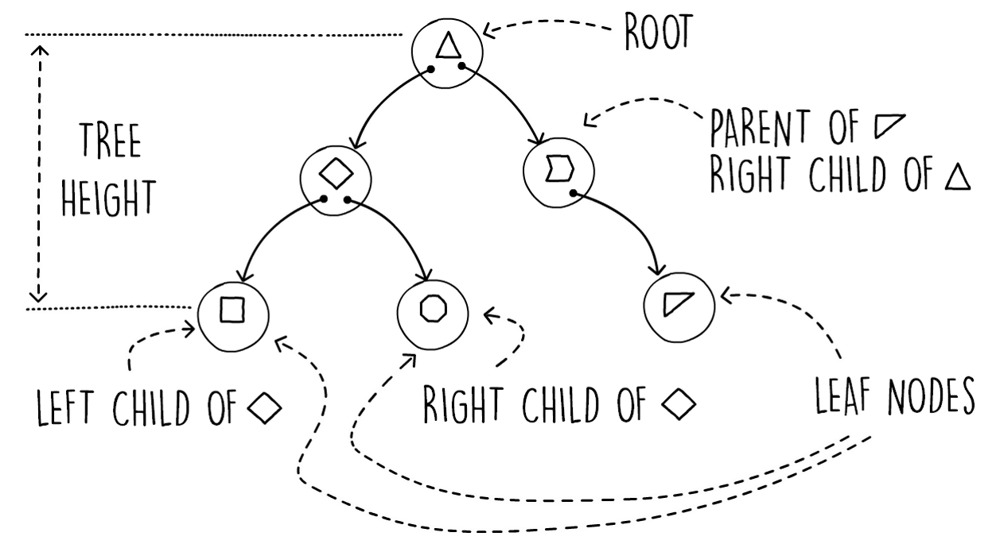
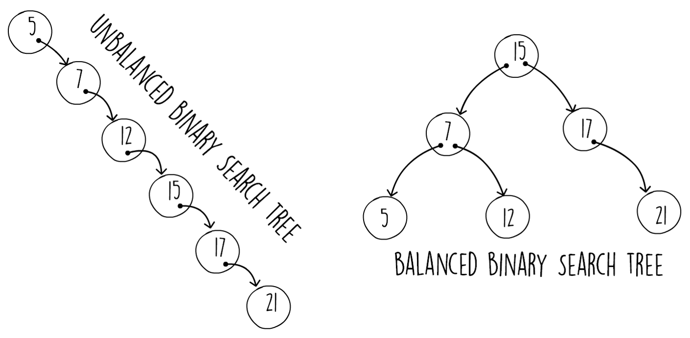
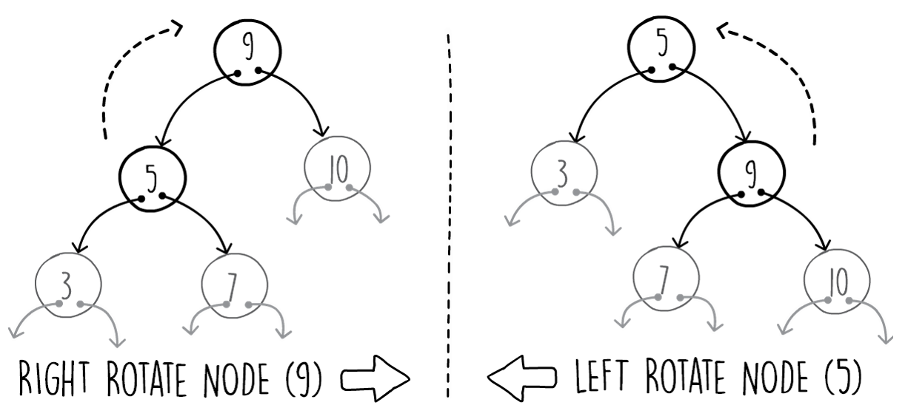

## Tree 
### Binary Tree Structure
- The structure of a binary tree is composed of a series of nodes connected together via pointers. Figure 3.8 shows the fundamental relation between nodes. Each node can have a maximum of two child nodes, a left one and a right one.
- Each node (except the top-level node) also has exactly one parent:
- 
- Figure 3.8: Showing a simple binary tree relation
- Figure 3.9 shows some more terminology applied to binary trees. In this diagram, we also show that binary tree nodes can hold data items by showing the node storing different shapes. The top-level node is called the root node. The root node in a tree structure is the only node that doesn't have a parent. Nodes that don't have any children are called leaf nodes. The height of a tree is the number of hops it would take you to get from the root node to the furthest leaf node. The diagram shows an example of a tree which has a height of 2.
- The height of a tree is an important metric, as it affects the performance. The shallower a tree is (smaller height), the more performant a tree structure is.
-  
- Figure 3.9: Binary tree terminology
- Similar to a linked list, the binary tree structure is modeled using pointers and node objects. In a linked list node, we only have a next pointer, referencing the next node in the list. Similarly, in a binary tree node we have two pointers, each one linking to one child. These are the left and right child pointers. The following code snippet shows how we can model the binary tree node using a Java class:
~~~java 
public class BinaryTreeNode<K,V> {
  private BinaryTreeNode<K,V> left;
  private BinaryTreeNode<K,V> right;
  private K key;
  private V value;
  public BinaryTreeNode(K key, V value) {
    this.key = key;
    this.value = value;
  } 
~~~  
- Snippet 3.8: The Binary tree node class. Some getters and setters have been omitted for brevity. Source class name: BinaryTreeNode
- Go to https://goo.gl/D6Jvo2 to access this code.
- We can then have another class representing the binary tree itself, where the operations will be implemented. This class only needs to hold a pointer to the root node, since any node can be reached by starting from the root node and navigating down. In the following code snippet, we show an interface declaring the binary tree:
~~~java 
public interface BinaryTree<K,V> {
  void put(K key,V value);
  Optional<V> get(K key);
} 
~~~
- Snippet 3.9: Binary tree interface. Source class name: BinaryTree.
- In this section, we have introduced the structure and terminology of binary trees. We then learned how to model each node using Java classes. In the next section, we will continue building on these concepts by introducing binary search trees and implementing the insert and search operations.

### Balanced Binary Search Trees
- The performance of a binary search tree is proportional to its height. This is because the search and insert operations start from the root and proceed down the tree one node at a time, doing a key comparison at each step. The taller the tree, the more steps are needed to accomplish this. Thus, if we determine the maximum possible height of a binary tree in relation to its input, we can find out the worst runtime complexity.
- If we insert keys in a binary tree, by always adding on the right child of the parent node, we end up with a tree similar to the one shown on the left-hand side of Figure 3.12. In this diagram, only the right child pointers on each node are being used. We end up with a tree of height n, where n is the number of items added to our data structure. We get this kind of one-sided tree when the key input pattern is in order.
- In the example shown in Figure 3.12, we first insert 5 as a root, then 7 is added as the right child, the next is 12 as the next right child, and so on. Always inserting an increasing number results in the next node on the right. This one type of input pattern makes our binary search tree operations (search, insert, and delete) behave in the worst-case runtime of O(n):
- Figure 3.12: Unbalanced versus balanced binary trees
- The result is similar if we start from a big number and decrease it each time. We end up with a mirror of the tree shown on the left-hand side of Figure 3.12.
- The output of a BFS traversal in a normal binary search tree when the key insert order is "1,2,3,4,5,6,7" would be in the same order as the input, that is, "1,2,3,4,5,6,7". We end up  creating a new right child at every insert. Since BFS traversal processes one level after another, starting from the root, the traversal output is the same as the input.
-  
- In Figure 3.12, on the right-hand side, we show another binary tree containing the same keys. This binary tree has been restructured with the effect that the tree is now shorter. Note that the tree is still valid, that is, the left child always has a key that is smaller than its parent, and vice versa. A balanced binary tree has a height of about log2n.
- If we manage to find a way to rebalance the binary search tree at each insert in O(log n) or better, the worst-case runtime performance for inserts and searches would also be of O(log n).
- Luckily, various algorithms exist that self-balance the tree structure as you perform inserts. Some of the most common ones are as follows:
    - AVL trees
    - Red black trees
    - AA trees
- All of these algorithms check that the binary tree is following specific balancing rules at key insert. If, due to a new node being inserted, the tree becomes unbalanced, the self-balancing algorithm kicks in and restructures some of the nodes to keep the tree balanced. The technique to rebalance the nodes relies on tree rotations, where under certain conditions some of the parent and child nodes are rotated. Importantly, these modifications are also performed in the worst-case of O(log n), meaning that both inserts and searches on binary trees have a worst runtime complexity of O(log n). In this section, we will examine tree rotations as they are the base operation for most self-balancing trees.
- For more information about self-balancing trees, you may refer the following resources:
- The Art of Computer Programming, Volume 3: Sorting and Searching by Donald Knuth.
- Paul E. Black, "red-black tree", in Dictionary of Algorithms and Data Structures [online], Vreda Pieterse and Paul E. Black, eds. 13 April 2015. Available at the link: https://www.nist.gov/dads/HTML/redblack.html.
- Figure 3.13 shows an example of a left and right rotation. Note how the node being rotated (node 5 in the right rotation and 9 in the left rotation) ends up being the new parent. Importantly, there is a constant number of child pointer reassignments. The properties of a binary search tree are still valid after a tree rotates, that is, a left child pointer always has a smaller key that points to its parent, and vice versa. This means that we can perform any number of these tree rotations and our binary search tree will still be valid:
-  
- Figure 3.13: Left and right tree rotations
- Snippet 3.15 shows how we perform a right rotation in Java. The method accepts a top-level node that needs rotation (node 5 in Figure 3.13) and its parent node. The method requires the parent node since it has to reassign its child pointer. Performing the opposite right rotation on the tree node is the mirror image of the following method:
~~~java 
public void leftRotate(BinaryTreeNode<K, V> nodeX,
 BinaryTreeNode<K, V> parent) {
  BinaryTreeNode<K, V> nodeY = nodeX.getRight().get();
  nodeX.setRight(nodeY.getLeft().orElse(null));
  if (parent == null)
    this.root = nodeY;
  else if (parent.getLeft().filter(n -> n == nodeX).isPresent())
    parent.setLeft(nodeY);
  else
    parent.setRight(nodeY);
    nodeY.setLeft(nodeX);
} 
~~~
- Snippet 3.15: Java implementation of the left tree rotation. Source class name: SimpleBinaryTree