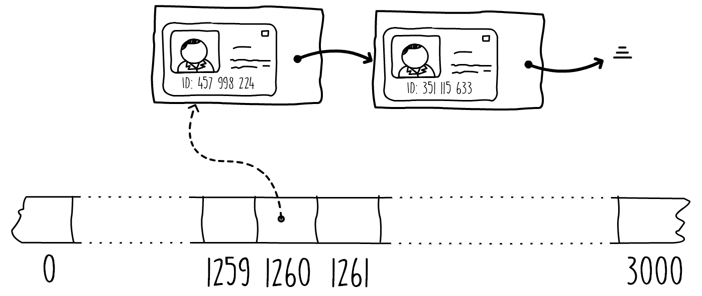
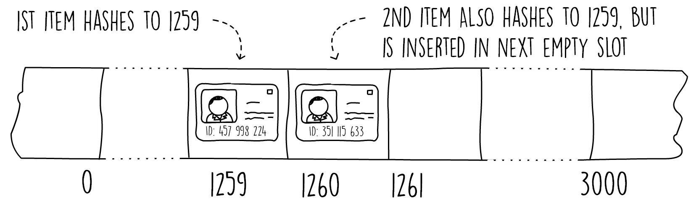
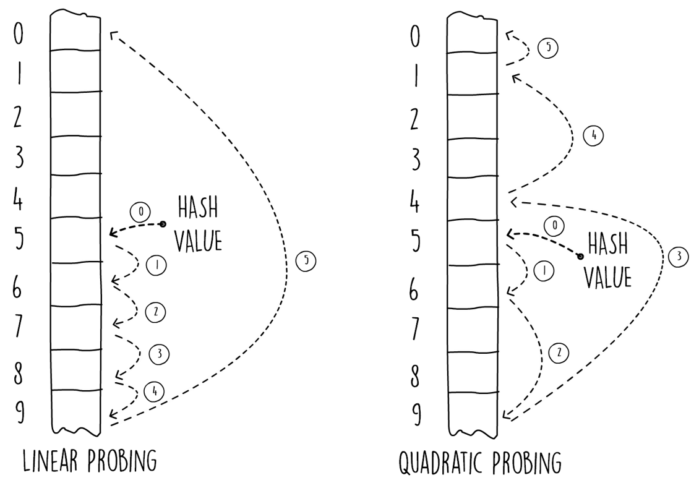

## Hashtables 

### Introducing Hash Tables
- A data structure that gives us the ability to insert, search, and optionally delete elements in a collection is called a data dictionary. 
- Commonly, the type of data used is a key-value pair association, where we insert the key-value pair but search using a key to obtain the value.
- Hash tables provide us with a fast data structure for organizing these key value pairs and implementing our data dictionary. 
- They are useful in a wide variety of applications due to the quick lookup and ease of use for in-memory data storage. 
- Insertion and search operations have a typical average runtime complexity of O(1).

### Understanding Hash Tables
- Let's look at an example problem to help us understand the need for hash tables. 
- Imagine you are a teacher, instructing a class of a maximum capacity of 30 students. 
- The students sit at their assigned desks every day. 
- To make your life easier, you decide to assign a sequential number from one to 30 to each desk. 
- You then use this number to identify each student, and use your self-developed app to bring up the student's records after you enter the desk number (see Figure 3.1). 
- This way, you can quickly look up details such as the student's name, date of birth, notes, and exam history:
-  
- Figure 3.1: App for displaying student's records for student at desk number eight
- In this problem, a simple array can be used to store all students' records in memory. Each of the array's positions can contain one student record. This would allow you to access the array directly using a strategy of index = deskNumber - 1. If, in a particular year you have fewer students, and not all the desks are occupied, you will place nulls at the corresponding array index. This solution is shown in Figure 3.2.
- This is an example of direct addressing, where each student's record is accessed using a key (the desk number). This type of solution can only be used when the possible key range is small enough to fit in an array which is directly in memory:
- 
- Figure 3.2: Example of direct addressing
-  To help us determine how efficiently we are using memory, we can measure the load factor. The load factor is simply a metric showing how fully utilized our data structure is. When the class is at max capacity, all the elements in the array will contain a record. We say that the load factor of our data structure is 1 (or at 100%). If, for example, only 15 students out of 30 spaces have registered for a particular year, the load factor is 0.5 (50%). A lower load factor value means that we are under-utilizing and wasting memory.
- Now, let's expand our example to include not just a class but an entire school, and instead of teaching one class, you have now been promoted to the head of the entire school. In this new position, you want to keep student records for every person currently enrolled. You also want to store historical records for any past students that are no longer in the school. You decide to use the national ID or passport number as a key to uniquely identify each one of your students. Assuming this is a US or an EU school, the national ID or passport number typically consists of nine numeric digits or more.
- Since our input range is quite big, directly addressing this would be very impractical.
- Since the US passport number (or national ID) is typically nine numeric digits, we would have to construct a huge array to store any possible number. For a nine-digit numeric range, the array's size would be 1,000,000,000. Assuming each pointer is four bytes, this array alone would  consume almost 4 GB! The load factor of this example would also be terribly low. Most of the array will be empty, as the school will only have a few thousand present and past students.
- We can still store the students' records in an array sized to a few thousand. All we need to do is find a way to squeeze our input key range into our array index range. Essentially, this means mapping our nine-digit numeric passport into a four-digit one. This job can be done by what is known as a hash function. A hash function would accept a key (our passport number) and return an array index within the size of our array (see Figure 3.3).
- We say that a hash function maps our input key universe to our chosen hash range, which in this example is our array size:
- 
- Figure 3.3: Using hash functions
- Using a hash function enables us to use a much smaller array and saves us a lot of memory. However, there is a catch. Since we are forcing a bigger key space into a smaller one, there is a risk that multiple keys map to the same hashed array index. This is what is called a collision; we have a key hash to an already filled position. The strategy on how to deal with collisions together with the choice of hash function make up our hash table. The following code snippet shows a Java interface that defines our hash table API. We will gradually implement this interface in later sections of this chapter:
~~~java
public interface HashTable<K,V> {
  void put(K key,V value);
  Optional<V> get(K key);
  void remove(K key);
}  
~~~
- Snippet 3.1: Hashtable interface. Source class name: Hashtable
- In Java, the classes java.util.Hashtable and java.util.HashMap both implement the interface HashTable. The main difference between the two classes is that the HashMap is unsynchronized and permits nulls.
- In this section, we first introduced direct addressing by looking at an example scenario. Later, we expanded the problem to a bigger key space, showing how hash tables can be used in such a scenario. In the next section, we will see two common solutions for dealing with hash table collisions.

### Dealing with Collisions with Chaining
-  What do we do when two keys hash to the same slot in our array? Overwriting the element in our array is not an option as this would mean losing records. One common solution to deal with collisions is a technique called chaining. In this solution, the hash table data is stored outside the actual array itself.
- The idea behind chaining is that each entry in our hash array has a pointer to its own linked list. Any items we add to our hash table are stored in these linked lists. Initially, every entry in the array is initialized to contain an empty linked list. Whenever we insert a particular array slot in the hash table, we insert it at the head of the linked list associated with that position. In this way, we can support hash collisions. Another insert, on an already occupied array slot, would result in a new item at the head of its linked list. Figure 3.4 shows an example in which two entries with different keys have hashed to the same array slot, resulting in the two records stored in the linked list:
- 
- Figure 3.4: Using linked lists to chain multiple entries in one hash slot
- Searching for a particular key requires first locating the array slot, and then traversing the linked list, one item at a time, looking for the required key until there is a match or the end of the list is reached. Snippet 3.2 shows the search (get) and insert (put). The delete (remove) operation can be found by the URL provided after the snippet. We make use of Java's linked list collection for this hash table implementation. In the constructor, the array is initialized with the given capacity, and each element is filled with an empty linked list.
- Using the Java linked list collections enables us to use Java's lambda expressions when searching for the key in the get(key) method. When searching, we try to match the key with the ones found in the linked list and only return the optional value if a match is found.
- Using the lambda expressions also enables us to implement the delete operation in a clean manner by just calling the removeif() method with a key-matching predicate (the delete operation can be found by the URL provided after the code snippet):
~~~java
public void put(K key, V value) {
  int hashValue = hashProvider.hashKey(key, array.length);
  array[hashValue].addFirst(new Pair<>(key, value));
}
public Optional<V> get(K key) {
  int hashValue = hashProvider.hashKey(key, array.length);
  return array[hashValue].stream()
    .filter(keyValue -> keyValue.getKey().equals(key))
    .findFirst()
    .map(Pair::getValue);
}  
~~~
- Snippet 3.2: The chained hash table. Source class name: ChainedHashTable
- The best case runtime complexity for the search operation (get() method) shown in Snippet 3.2 when the hash table contains n items is when we have no collisions, resulting in O(1), and the worst is when we have n collisions, resulting in O(n).
- The HashProvider interface shown in Snippet 3.2 simply provides us with a method that implements a hash function. We will implement this interface in the following sections when we explore different hash techniques. The runtime complexity for the chained hash table is dictated by how long our linked lists get. The best case is when every single item we insert in the hash table hashes to a different slot, that is, when there are no collisions. In the best case, we have a runtime of O(1) when each linked list only contains one item, and we can directly access any item.
- The worst-case is the other extreme, when every single item hashes to the same value, resulting in a linked list with n items. When this happens, the performance degrades to O(n) time to search for the required key. This is because we need to traverse the linked list of n nodes to search the required key.
- This worst runtime complexity of O(n) is applicable to all hash tables, not just chained ones. However, on average, and if the right hash function is chosen, the runtime performance of hash tables can be close to O(1).
- A chained hash table has no load limit. Even in situations where none of the slots are empty, we can still add more items to the hash tables by continuing to append to the linked lists. This means that the load factor of a chained hash table can exceed the value of 1.
- Chained hash tables are the most popular collision resolution implementation. The reason for this is that they are easy to implement, provide a good performance, and unlike some other techniques, allow the hash table structure to scale dynamically, and grow beyond the load factor of 1. In the next section, we will discuss another solution dealing with collisions, called open addressing.

### Dealing with Collisions with Open Addressing
- In the previous section, we saw how we can deal with collisions using linked lists at each array position. A chained hash table will keep on growing without any load limit. Open addressing is just another way of tackling hash collisions. In open addressing, all items are stored in the array itself, making the structure static with a maximum load factor limit of 1. This means that once the array is full, you can't add any more items. The advantage of using open addressing is that, since you're not using linked lists, you're saving a bit of memory since you don't have to store any pointer references.
- You can then use this extra memory to have an even larger array and hold more of your key value pairs. To insert in an open-addressed hash table, we hash the key and simply insert the item in the hash slot, the same as a normal hash table. If the slot is already occupied, we search for another empty slot and insert the item in it. The manner in which we search for another empty slot is called the probe sequence.
- A simple strategy, shown in Figure 3.5, is to search by looking at the next available slot. This is called linear probing, where we start from the array index at the hash value and keep on increasing the index by one until we find an empty slot. The same probing technique needs to be used when searching for a key. We start from the hash slot and keep on advancing until we match the key or encounter an empty slot:
- 
- Figure 3.5: Linear probing in open addressing
- The next code snippet shows the pseudocode for linear probing insert. In this code, after we find the hash value we keep on increasing a pointer by one, searching for an empty slot.
- Once we reach the end of the array, we wrap around to the start using the modulus operator. This technique is similar to one we used when we implemented array-based stacks. We stop increasing the array pointer either when we find a null value (empty slot) or when we get back to where we started, meaning the hash table is full. Once we exit the loop, we store the key-value pair, but only if the hash table is not full.
- The pseudocode is as follows:
~~~java
insert(key, value, array)
  s = length(array)
  hashValue = hash(key, s)
  i = 0
  while (i < s and array[(hashValue + i) mod s] != null)
    i = i + 1
  if (i < s) array[(hashValue + i) mod s] = (key, value)
~~~    
- Snippet 3.3: Pseudocode for inserting using linear probing
- Searching for a key is similar to the insert operation. We first need to find the hash value from the key and then search the array in a linear fashion until we encounter the key, find a null value, or traverse the length of the array.
- If we want to delete items from our open, addressed hash table, we cannot simply remove the entry from our array and mark it as null. If we did this, the search operation would not be able to check all possible array positions for which the key might have been found. This is because the search operation stops as soon as it finds a null.
- One solution is to add a flag at each array position to signify that an item has been deleted without setting the entry to null. The search operation can then be modified to continue past entries marked as deleted. The insert operation also needs to be changed so that, if it encounters an entry marked as deleted, it writes the new item at that position.
- Linear probing suffers from a problem called clustering. This occurs when a long succession of non-empty slots develop, degrading the search and insert performance. One way to improve this is to use a technique called quadratic probing. This strategy is similar to linear probing, except that we probe for the next empty slot using a quadratic formula of the form h + (ai + bi2), where h is the initial hash value, and a and b are constants. Figure 3.6 shows the difference between using linear and quadratic probing with a = 0 and b = 1. The diagram shows the order in which both techniques explore the array.
- In quadratic probing, we would change Snippet 3.3 to check at array indexes of the following:
-  array[(hashValue + a*i + b*i^2) mod s]
-  
- Figure 3.6 Linear versus quadratic probing
- Although quadratic probing reduces the effect of clustering, it suffers from a problem called secondary clustering. This is a milder form of clustering, however, it will still degrade performance. In addition, the constants a and b, and the array size need to be carefully chosen so that the probing explores the entire array.
- One other probing strategy used in open-addressing hash tables is called double hashing. This makes use of another hash function to determine the step offset from the initial hash value. In double hashing, we probe the array using the expression h + ih'(k), where h is the hash value and h'(k) is a secondary hash function applied on the key. The probing mechanism is similar to linear probing, where we start with an i of zero and increase by one on every collision. Doing so results in probing the array every h'(k) step. The advantage of double hashing is that the probing strategy changes on every key insert, reducing the chances of clustering.
- In double hashing, care must be taken to ensure that the entire array is explored. This can be achieved using various tricks. For example, we can size our array to an even number and make sure the secondary hash function returns only odd numbers.