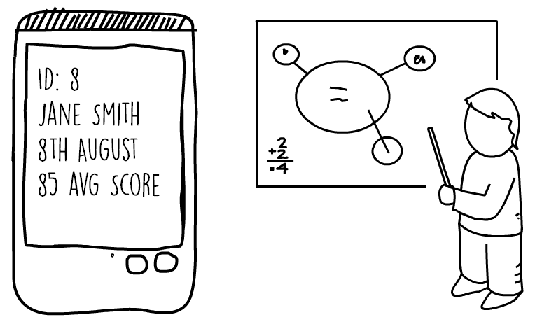
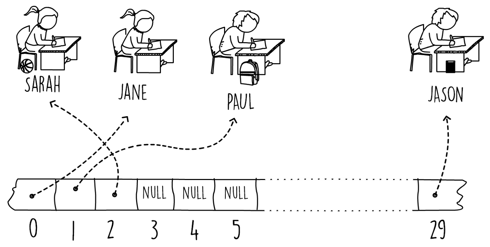
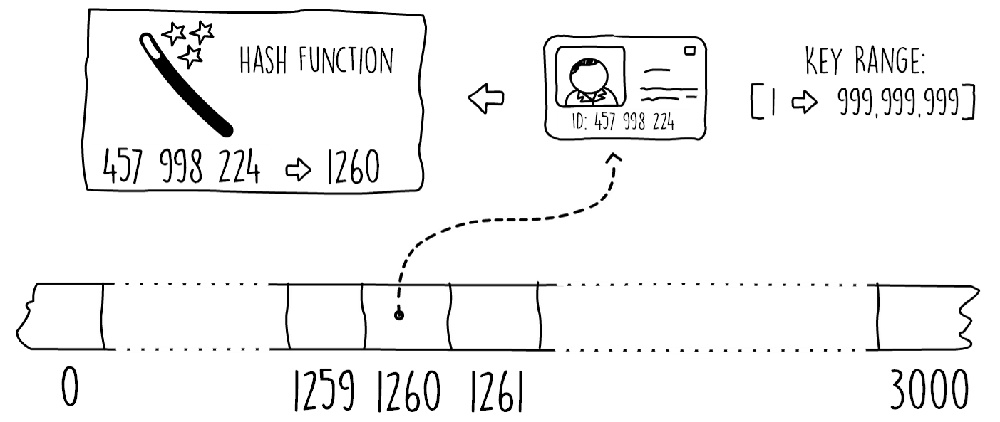

## Hashtables 

### Introducing Hash Tables
- A data structure that gives us the ability to insert, search, and optionally delete elements in a collection is called a data dictionary. 
- Commonly, the type of data used is a key-value pair association, where we insert the key-value pair but search using a key to obtain the value.
- Hash tables provide us with a fast data structure for organizing these key value pairs and implementing our data dictionary. 
- They are useful in a wide variety of applications due to the quick lookup and ease of use for in-memory data storage. 
- Insertion and search operations have a typical average runtime complexity of O(1).

### Understanding Hash Tables
- Let's look at an example problem to help us understand the need for hash tables. 
- Imagine you are a teacher, instructing a class of a maximum capacity of 30 students. 
- The students sit at their assigned desks every day. 
- To make your life easier, you decide to assign a sequential number from one to 30 to each desk. 
- You then use this number to identify each student, and use your self-developed app to bring up the student's records after you enter the desk number (see Figure 3.1). 
- This way, you can quickly look up details such as the student's name, date of birth, notes, and exam history:
-  
- Figure 3.1: App for displaying student's records for student at desk number eight
- In this problem, a simple array can be used to store all students' records in memory. Each of the array's positions can contain one student record. This would allow you to access the array directly using a strategy of index = deskNumber - 1. If, in a particular year you have fewer students, and not all the desks are occupied, you will place nulls at the corresponding array index. This solution is shown in Figure 3.2.
- This is an example of direct addressing, where each student's record is accessed using a key (the desk number). This type of solution can only be used when the possible key range is small enough to fit in an array which is directly in memory:
- 
- Figure 3.2: Example of direct addressing
-  To help us determine how efficiently we are using memory, we can measure the load factor. The load factor is simply a metric showing how fully utilized our data structure is. When the class is at max capacity, all the elements in the array will contain a record. We say that the load factor of our data structure is 1 (or at 100%). If, for example, only 15 students out of 30 spaces have registered for a particular year, the load factor is 0.5 (50%). A lower load factor value means that we are under-utilizing and wasting memory.
- Now, let's expand our example to include not just a class but an entire school, and instead of teaching one class, you have now been promoted to the head of the entire school. In this new position, you want to keep student records for every person currently enrolled. You also want to store historical records for any past students that are no longer in the school. You decide to use the national ID or passport number as a key to uniquely identify each one of your students. Assuming this is a US or an EU school, the national ID or passport number typically consists of nine numeric digits or more.
- Since our input range is quite big, directly addressing this would be very impractical.
- Since the US passport number (or national ID) is typically nine numeric digits, we would have to construct a huge array to store any possible number. For a nine-digit numeric range, the array's size would be 1,000,000,000. Assuming each pointer is four bytes, this array alone would  consume almost 4 GB! The load factor of this example would also be terribly low. Most of the array will be empty, as the school will only have a few thousand present and past students.
- We can still store the students' records in an array sized to a few thousand. All we need to do is find a way to squeeze our input key range into our array index range. Essentially, this means mapping our nine-digit numeric passport into a four-digit one. This job can be done by what is known as a hash function. A hash function would accept a key (our passport number) and return an array index within the size of our array (see Figure 3.3).
- We say that a hash function maps our input key universe to our chosen hash range, which in this example is our array size:
- 
- Figure 3.3: Using hash functions
- Using a hash function enables us to use a much smaller array and saves us a lot of memory. However, there is a catch. Since we are forcing a bigger key space into a smaller one, there is a risk that multiple keys map to the same hashed array index. This is what is called a collision; we have a key hash to an already filled position. The strategy on how to deal with collisions together with the choice of hash function make up our hash table. The following code snippet shows a Java interface that defines our hash table API. We will gradually implement this interface in later sections of this chapter:
~~~java
public interface HashTable<K,V> {
  void put(K key,V value);
  Optional<V> get(K key);
  void remove(K key);
}  
~~~
- Snippet 3.1: Hashtable interface. Source class name: Hashtable
- In Java, the classes java.util.Hashtable and java.util.HashMap both implement the interface HashTable. The main difference between the two classes is that the HashMap is unsynchronized and permits nulls.
- In this section, we first introduced direct addressing by looking at an example scenario. Later, we expanded the problem to a bigger key space, showing how hash tables can be used in such a scenario. In the next section, we will see two common solutions for dealing with hash table collisions.