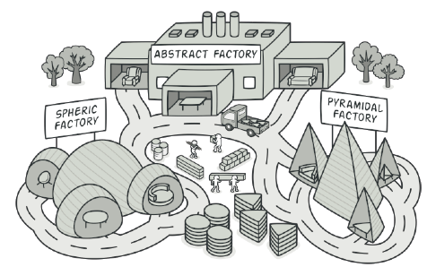
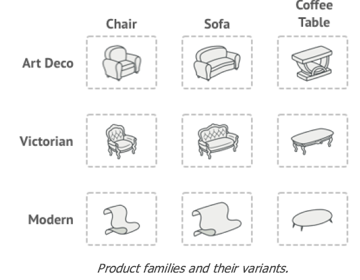

## Intent
- Abstract Factory is a creational design pattern that lets you produce families of related objects without specifying their concrete classes.
- 
- 
- The first thing the Abstract Factory pattern suggests is to explicitly declare interfaces for each distinct product of the product family (e.g., chair, sofa or coffee table). 
    - Then you can make all variants of products follow those interfaces. 
        - For example, all chair variants can implement the Chair interface; 
        - all coffee table variants can implement the CoffeeTable interface, and so on.