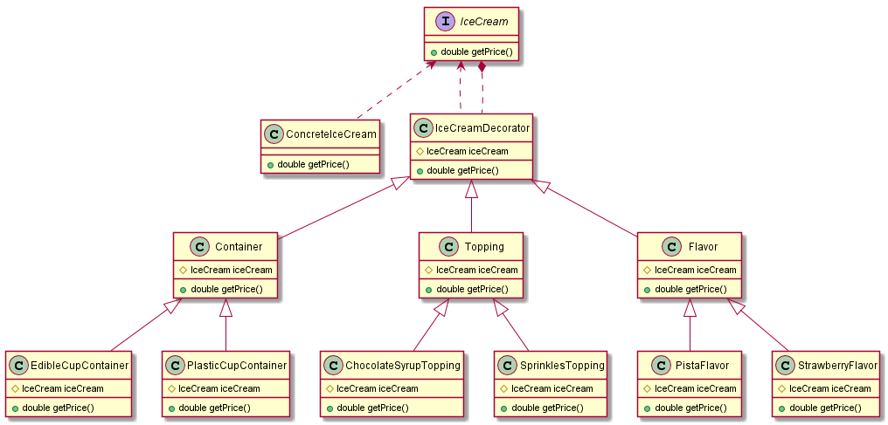

## Decorator Pattern 

### Decorator Class Diagram 
- 
 
### Common Interface 
- A single core component, several optional wrappers and a "common interface".
- Create a "common interface" that makes all classes interchangeable.
~~~java
public interface IceCream {
    double getPrice();
} 
~~~
### Abstract Decorator  
- Create Decorator to support the optional wrapper classes.
- The Decorator class declares a composition relationship to the "common interface", and this data member is initialized in its constructor.
- The Decorator class delegates to the "common interface".
~~~java
public abstract class IceCreamDecorator implements IceCream{
    IceCream iceCream;

    public IceCreamDecorator(IceCream iceCream) {
        this.iceCream = iceCream;
    }

    public double getPrice() {
        return iceCream.getPrice();
    }
} 
~~~

### Core Component
- The Core class and Decorator class inherit from the same "common interface".
~~~java
public class ConcreteIceCream implements IceCream {
    public double getPrice() {
        return 1.0;
    }
} 
~~~

### Decorator derived classes
- Define a **Decorator derived class** for each optional wrapper.
- **Decorator derived classes** 
    - implement their wrapper functionality 
    - delegate to the Decorator base class
~~~java
public class Container extends IceCreamDecorator {
    public Container(IceCream iceCream) {
        super(iceCream);
    }
}

public class EdibleConeContainer extends Container {
    public EdibleConeContainer(IceCream iceCream) {
        super(iceCream);
    }

    public double getPrice(){
        return super.getPrice() + 0.40;
    }
}

public class Flavor extends IceCreamDecorator {
    public Flavor(IceCream iceCream) {
        super(iceCream);
    }
}

public class StrawberryFlavor extends Flavor {
    public StrawberryFlavor(IceCream iceCream) {
        super(iceCream);
    }

    public double getPrice(){
        return super.getPrice() + 2.0;
    }
}
~~~    

### Client 
- The client configures the type and ordering of Core and Decorator objects. 
~~~java
public class IceCreamShop {
    public static void main(String[] args) {
        IceCream iceCream = new VanillaFlavor(
                new PlasticCupContainer(
                        new ConcreteIceCream()
                )
        );
        System.out.println(iceCream.getPrice());

        iceCream = new VanillaFlavor(
                new EdibleConeContainer(
                        new ConcreteIceCream()
                )
        );
        System.out.println(iceCream.getPrice());

        iceCream = new VanillaFlavor(
                new EdibleCupContainer(
                        new ConcreteIceCream()
                )
        );
        System.out.println(iceCream.getPrice());

        iceCream = new VanillaFlavor(
                new StrawberryFlavor(
                        new EdibleCupContainer(
                                new ConcreteIceCream()
                        )
                )
        );
        System.out.println(iceCream.getPrice());

        iceCream = new VanillaFlavor(
                new StrawberryFlavor(
                        new EdibleCupContainer(
                                new ChocolateSyrupTopping(
                                        new ConcreteIceCream()
                                )
                        )
                )
        );
        System.out.println(iceCream.getPrice());
    }
}

    Output :
            
    2.25
    2.4
    2.8
    4.8
    5.3        
~~~

### Comparison with other Patterns 
- Adapter provides a different interface to its subject. 
    - Proxy provides the same interface. 
    - Decorator provides an enhanced interface.
- Adapter changes an object's interface, 
    - Decorator enhances an object's responsibilities. 
    - Decorator is thus more transparent to the client. 
    - **Decorator supports recursive composition**, which isn't possible with pure Adapters.
- Composite and Decorator have similar structure diagrams, 
    -reflecting the fact that both rely on recursive composition to organize an open-ended number of objects.
- A Decorator can be viewed as a degenerate Composite with only one component. 
    - However, a Decorator adds additional responsibilities - it isn't intended for object aggregation.
- Decorator is designed to let you add responsibilities to objects without subclassing. 
    - Composite's focus is not on wrapper but on representation. 
    - These intents are distinct but complementary. 
- Composite could use Chain of Responsibility to let components access global properties through their parent. 
    - It could also use Decorator to override these properties on parts of the composition.
- Decorator and Proxy have different purposes but similar structures. 
    - Both describe how to provide a level of indirection to another object, 
    - Implementations keep a reference to the object to which they forward requests.
- Decorator lets you change the skin of an object. 
    - Strategy lets you change the guts.