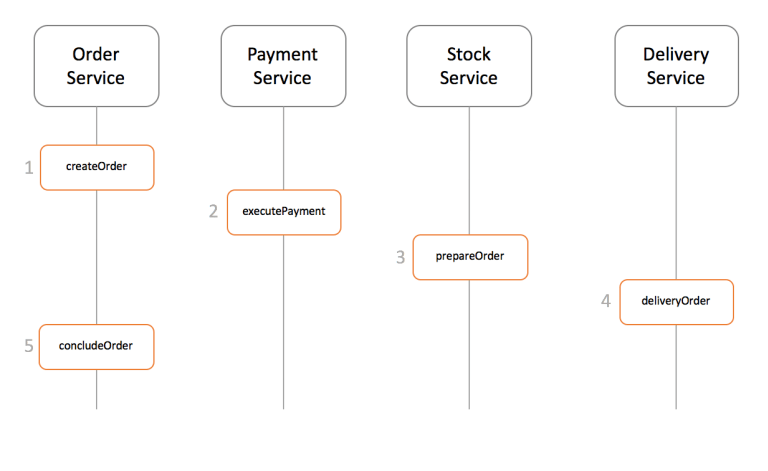
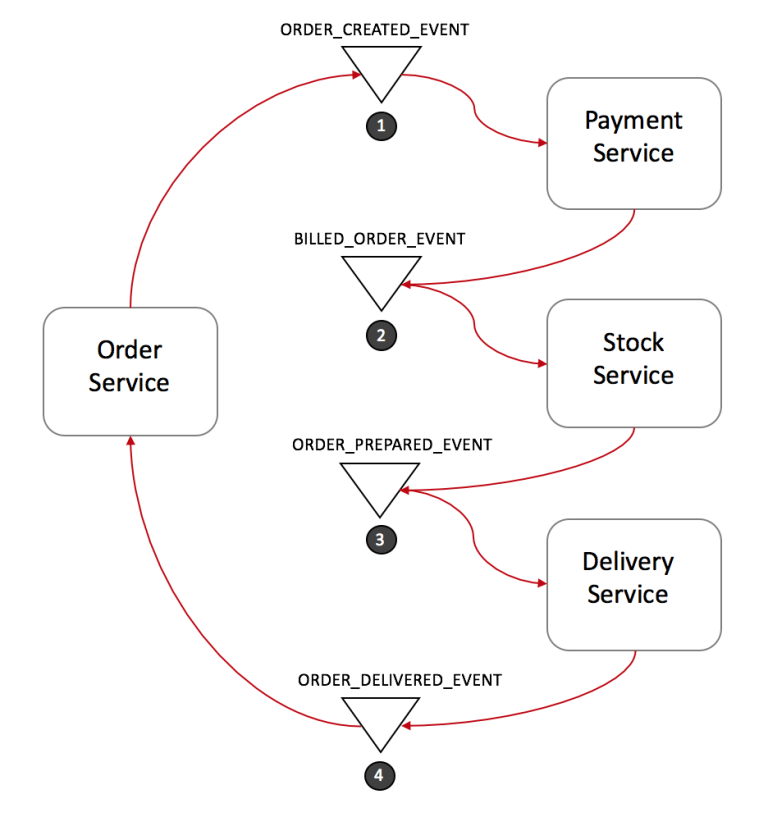

## The SAGA Pattern
- One of the most well-known patterns for distributed transactions is called Saga. The first paper about it was published back in 1987 and has it been a popular solution since then.
- A saga is a sequence of local transactions where each transaction updates data within a single service. The first transaction is initiated by an external request corresponding to the system operation, and then each subsequent step is triggered by the completion of the previous one.
- Using our previous e-commerce example, in a very high-level design a saga implementation would look like the following:
    - o
    - 
    - o
- There are a couple of different ways to implement a saga transaction, but the two most popular are:
    - Events/Choreography: When there is no central coordination, each service produces and listen to other service’s events and decides if an action should be taken or not.
    - Command/Orchestration: when a coordinator service is responsible for centralizing the saga’s decision making and sequencing business logic 

### Events/Choreography
- In the Events/Choreography approach, the first service executes a transaction and then publishes an event. This event is listened by one or more services which execute local transactions and publish (or not) new events.
- The distributed transaction ends when the last service executes its local transaction and does not publish any events or the event published is not heard by any of the saga’s participants.
- Let’s see how it would look like in our e-commerce example:    
    - o
    - 
    - o