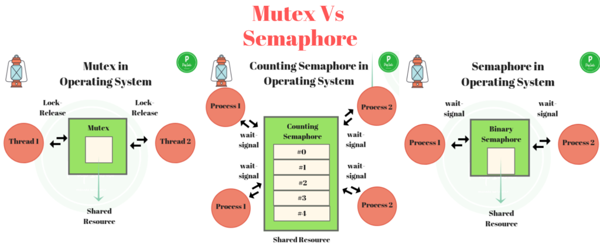

## Mutex Vs Semaphore in OS
- What is the difference between Mutex and Semaphore in Operating System
    - Mutex is essentially a locking and releasing mechanism and however, 
    - Semaphore is a signalling mechanism. 
    - Both are used for Critical section and mutual exclusion problems.
    - Most people think that Binary Semaphore and Mutex are essentially the same but they are not.
    
## Mutex
- Example – Imagine mutex as a key to a single toilet. 
- Only one person can be inside the toilet at a time and he would want to lock the toilet and others waiting for toilet access must wait for person already inside to release the toilet. 
- When finished the person gives the key to next person in the queue.
- Mutex is for thread.
- Mutex is essentially atomic and singular in nature.
- Mutex is binary in nature.
- Operations like Lock and Release are possible
- Mutex works in userspace
- Only one thread can acquire a mutex at a time
- Mutex is an object

## Semaphore
- Example – Imagine a bathroom with 4 identical toilets here, identical keys can open the bathrooms. 
- Here as many as 4 people can use the bathroom simultaneously and they wait and signal one another about the occupancy of the bathrooms
- Semaphore is for processes
- Semaphores are also atomic but not singular in nature
- Semaphores are of two types that are binary and counting
- Semaphores work in kernel space
- Only one process can acquire binary semaphore at a time but multiple processes can simultaneously acquire semaphore in case of counting semaphore
- Semaphore is an integer variable
    - O------------------------------------------------------------------------------------------
    - 
    - O------------------------------------------------------------------------------------------

## What is SpinLock ?
- While a process is in critical section, 
- any other process which waits to enter critical section must loop continuously in call to acquire. 
- This is a spinlock as the process “Spins” while waiting for the lock to be available.
- Advantages –
    - No Context switch is required for a process waiting on a lock.
    - Good for systems where it’s known that locks are of short duration.
    - Employed in Multiprocess system,  
        - where one thread can spin on 1 processor while another thread processes its critical section in another processor.
- Semaphores –
- It’s  a Generalized Mutex.
- Semaphores are integer variable , which is accessed through 2 atomic operations, wait() and signal ().
- It’s a signalling Mechanism.    
 