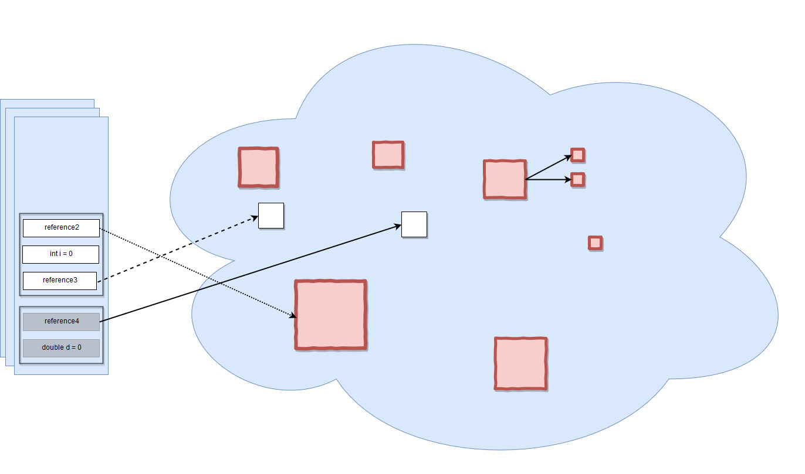

### Java Memory Management

- You might think that if you are programming in Java, what do you need to know about how memory works? Java has automatic memory management, a nice and quiet garbage collector that works in the background to clean up the unused objects and free up some memory.
- Therefore, you as a Java programmer do not need to bother yourself with problems like destroying objects, as they are not used anymore. However, even if this process is automatic in Java, it does not guarantee anything. By not knowing how the garbage collector and Java memory is designed, you could have objects that are not eligible for garbage collecting, even if you are no longer using them.
- So knowing how memory actually works in Java is important, as it gives you the advantage of writing high-performance and optimized applications that will never ever crash with an OutOfMemoryError. On the other hand, when you find yourself in a bad situation, you will be able  to quickly find the memory leak.
- To start with, let’s have a look at how the memory is generally organized in Java:
    - o
    - 
    - o
- Generally, memory is divided into two big parts: the stack and the heap. 
    - Please keep in mind that the size of memory types in this picture are not proportional to the memory size in reality. 
    - The heap is a huge amount of memory compared to the stack.
#### The Stack
- Stack memory is responsible for holding references to heap objects and for storing value types (also known in Java as primitive types), which hold the value itself rather than a reference to an object from the heap.
- In addition, variables on the stack have a certain visibility, also called scope. Only objects from the active scope are used. For example, assuming that we do not have any global scope variables (fields), and only local variables, if the compiler executes a method’s body, it can access only objects from the stack that are within the method’s body. It cannot access other local variables, as those are out of scope. Once the method completes and returns, the top of the stack pops out, and the active scope changes.
- Maybe you noticed that in the picture above, there are multiple stack memories displayed. This due to the fact that the stack memory in Java is allocated per Thread. Therefore, each time a Thread is created and started, it has its own stack memory — and cannot access another thread’s stack memory.
#### The Heap
- This part of memory stores the actual object in memory. Those are referenced by the variables from the stack. For example, let’s analyze what happens in the following line of code:
    ~~~java
    StringBuilder builder = new StringBuilder();
    ~~~
- The new keyword is responsible for ensuring that there is enough free space on heap, creating an object of the StringBuilder type in memory and referring to it via the “builder” reference, which goes on the stack.
- There exists only one heap memory for each running JVM process. Therefore, this is a shared part of memory regardless of how many threads are running. Actually, the heap structure is a bit different than it is shown in the picture above. The heap itself is divided into a few parts, which facilitates the process of garbage collection.
- The maximum stack and the heap sizes are not predefined — this depends on the running machine. However, later in this article, we will look into some JVM configurations that will allow us to specify their size explicitly for a running application.
#### Reference Types
- If you look closely at the Memory Structure picture, you will probably notice that the arrows representing the references to the objects from the heap are actually of different types. That is because, in the Java programming language, we have different types of references: strong, weak, soft, and phantom references. The difference between the types of references is that the objects on the heap they refer to are eligible for garbage collecting under the different criteria. Let’s have a closer look at each of them.
    - Strong Reference
        - These are the most popular reference types that we all are used to. In the example above with the StringBuilder, we actually hold a strong reference to an object from the heap. The object on the heap it is not garbage collected while there is a strong reference pointing to it, or if it is strongly reachable through a chain of strong references.
    - Weak Reference
        - In simple terms, a weak reference to an object from the heap is most likely to not survive after the next garbage collection process. A weak reference is created as follows:
            ~~~java
              WeakReference<StringBuilder> reference = new WeakReference<>(new StringBuilder());
            ~~~
    - A nice use case for weak references are caching scenarios. 
        - Imagine that you retrieve some data, and you want it to be stored in memory as well — the same data could be requested again. 
        - On the other hand, you are not sure when, or if, this data will be requested again. 
        - So you can keep a weak reference to it, and in case the garbage collector runs, it could be that it destroys your object on the heap. 
        - Therefore, after a while, if you want to retrieve the object you refer to, you might suddenly get back a null value. 
        - A nice implementation for caching scenarios is the collection WeakHashMap<K,V>. 
        - If we open the WeakHashMap class in the Java API, we see that its entries actually extend the WeakReference class and uses its ref field as the map’s key:
            ~~~java
            /**
                * The entries in this hash table extend WeakReference, using its main ref
                * field as the key.
            */
            private static class Entry<K,V> extends WeakReference<Object> implements Map.Entry<K,V> {
                V value;
            ~~~
        - Once a key from the WeakHashMap is garbage collected, the entire entry is removed from the map.

    - Soft Reference
        - These types of references are used for more memory-sensitive scenarios, since those are going to be garbage collected only when your application is running low on memory. Therefore, as long as there is no critical need to free up some space, the garbage collector will not touch softly reachable objects. Java guarantees that all soft referenced objects are cleaned up before it throws an OutOfMemoryError. The Javadocs state, “all soft references to softly-reachable objects are guaranteed to have been cleared before the virtual machine throws an OutOfMemoryError.”
        - Similar to weak references, a soft reference is created as follows:
        ~~~java
          SoftReference<StringBuilder> reference = new SoftReference<>(new StringBuilder());
        ~~~

    - Phantom Reference
        - Used to schedule post-mortem cleanup actions, since we know for sure that objects are no longer alive. Used only with a reference queue, since the .get() method of such references will always return null. These types of references are considered preferable to finalizers.

    - How Strings Are Referenced
        - The String type in Java is a bit differently treated. Strings are immutable, meaning that each time you do something with a string, another object is actually created on the heap. For strings, Java manages a string pool in memory. This means that Java stores and reuse strings whenever possible. This is mostly true for string literals. For example:
        ~~~java
            String localPrefix = "297"; //1
            String prefix = "297";      //2
            if (prefix == localPrefix)
            {
                System.out.println("Strings are equal" );
            }
            else
            {
                System.out.println("Strings are different");
            }
        ~~~
    - When running, this prints out the following:
    - Strings are equal
    - Therefore, it turns out that after comparing the two references of the String type, those actually point to the same objects on the heap. However, this is not valid for Strings that are computed. Let’s assume that we have the following change in line //1 of the above code
    - String localPrefix = new Integer(297).toString(); //1
    - Output:
    - Strings are different
    - In this case, we actually see that we have two different objects on the heap. If we consider that the computed String will be used quite often, we can force the JVM to add it to the string pool by adding the .intern() method at the end of computed string:
    - String localPrefix = new Integer(297).toString().intern(); //1
    - Adding the above change creates the following output:
    - Strings are equal
#### Garbage Collection Process
- As discussed earlier, depending on the type of reference that a variable from the stack holds to an object from the heap, at a certain point in time, that object becomes eligible for the garbage collector.
    - o
    - 
    - o   
    - Garbage-eligible objects
- For example, all objects that are in red are eligible to be collected by the garbage collector. 
    - You might notice that there is an object on the heap, which has strong references to other objects that are also on the heap 
    - (e.g. could be a list that has references to its items, or an object that has two referenced type fields). 
    - However, since the reference from the stack is lost, it cannot be accessed anymore, so it is garbage as well.
- When the garbage collector runs, all threads in your application are paused 
    - (depending on the GC type, which will be discussed later).
- This is actually a more complicated process than just garbage collecting and freeing up memory.
- Even though Java decides when to run the garbage collector, 
    - you may explicitly call System.gc() and 
    - You only kind of ask Java to run the garbage collector, 
        - but it’s, again, up to it whether or not to do that. 
        - Anyway, explicitly calling System.gc() is not advised.
- Since this is a quite complex process, and it might affect you performance, it is implemented in a smart way. 
- A so-called “Mark and Sweep” process is used for that. 
- Java analyzes the variables from the stack and “marks” all the objects that need to be kept alive. 
- Then, all the unused objects are cleaned up.
- So actually, Java does not collect any garbage. 
- In fact, the more garbage there is, and the fewer that objects are marked alive, the faster the process is. 
- To make this even more optimized, heap memory actually consists of multiple parts. 
- We can visualize the memory usage and other useful things with JVisualVM, a tool that comes with the Java JDK. 
- The only thing you have to do is install a plugin named Visual GC, which allows you to see how the memory is actually structured. 
- Let’s zoom in a bit and break down the big picture:     

#### GC
- When an object is created, it is allocated on the Eden(1) space. 
- Because the Eden space is not that big, it gets full quite fast. 
- The garbage collector runs on the Eden space and marks objects as alive.
- Once an object survives a garbage collecting process, it gets moved into a so-called survivor space S0(2). 
- The second time the garbage collector runs on the Eden space, it moves all surviving objects into the S1(3) space. 
- Also, everything that is currently on S0(2) is moved into the S1(3) space.
- If an object survives for X rounds of garbage collection (X depends on the JVM implementation, in my case it’s 8), 
- it is most likely that it will survive forever, and it gets moved into the Old(4) space.
- The old generation can be also garbage collected, 
    - but since it is a bigger part of the memory compared to Eden space, 
    - it does not happen that often. 
- The Metaspace(5) is used to store the metadata about your loaded classes in the JVM.

### Garbage Collector Types
- Actually, the JVM has three types of garbage collectors, and the programmer can choose which one should be used. 
- By default, Java chooses the garbage collector type to be used based on the underlying hardware.
    - Serial GC – A single thread collector. 
        - Mostly applies to small applications with small data usage. 
        - Can be enabled by specifying the command line option: **-XX:+UseSerialGC**
    - Parallel GC – Even from the naming, 
        - the difference between Serial and Parallel would be that Parallel GC uses multiple threads to perform the garbage collecting process. 
        - This GC type is also known as the throughput collector. 
        - It can be enabled by explicitly specifying the option: **-XX:+UseParallelGC**
    - Mostly concurrent GC – 
        - garbage collecting process is actually pretty expensive, and when it runs, all thread are paused. 
        - mostly concurrent GC type states that it works concurrent to the application. 
        - It does not work 100% concurrently to the application. 
        - There is a period of time for which the threads are paused, pause is short to achieve the best GC performance. 
        - There are 2 types of mostly concurrent GCs:
            - Garbage First 
                – high throughput with a reasonable application pause time. 
                - Enabled with the option: -XX:+UseG1GC
            - Concurrent Mark Sweep 
                – The application pause time is kept to a minimum. 
                - It can be used by specifying the option: -XX:+UseConcMarkSweepGC. 
                - As of JDK 9, this GC type is deprecated.
                
#### Tips and Tricks
- To minimize the memory footprint, limit the scope of the variables as much as possible. 
    - Remember that each time the top scope from the stack is popped up, 
    - the references from that scope are lost, and 
    - this could make objects eligible for garbage collecting.
- Explicitly refer to null obsolete references. 
    - That will make objects those references refer to eligible for garbage collecting.
- Avoid finalizers. 
    - They slow down the process and they do not guarantee anything. 
    - Prefer phantom references for cleanup work.
- Do not use strong references where weak or soft references apply. 
    - The most common memory pitfalls are caching scenarios, 
    - when data is held in memory even if it might not be needed.
- JVisualVM also has the functionality to make a heap dump at a certain point, 
    - so you could analyze, per class, how much memory it occupies.
- Configure your JVM based on your application requirements. 
    - Explicitly specify the heap size for the JVM when running the application. 
    - The memory allocation process is also expensive, 
    - so allocate a reasonable initial and maximum amount of memory for the heap. 
    - If you know it will not make sense to start with a small initial heap size from the beginning, 
    - the JVM will extend this memory space. 
    - Specifying the memory options with the following options:
        - Initial heap size -Xms512m – set the initial heap size to 512 megabytes.
        - Maximum heap size -Xmx1024m – set the maximum heap size to 1024 megabytes.
        - Thread stack size -Xss128m – set the thread stack size to 128 megabytes.
        - Young generation size -Xmn256m – set the young generation size to 256 megabytes.
- If a Java application crashes with an OutOfMemoryError and 
    - you need some extra info to detect the leak, 
    - run the process with the –XX:HeapDumpOnOutOfMemory parameter, 
    - which will create a heap dump file when this error happens next time.
- Use the -verbose:gc option to get the garbage collection output. 
    - Each time a garbage collection takes place, an output will be generated.                