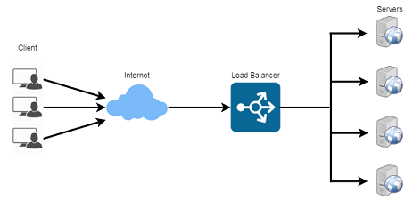
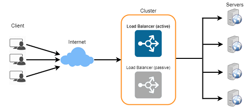

- Load Balancer (LB) is another critical component of any distributed system. 
- It helps to spread the traffic across a cluster of servers to improve responsiveness and availability of applications, websites or databases. 
- LB also keeps track of the status of all the resources while distributing requests. 
- If a server is not available to take new requests or is not responding or has elevated error rate, LB will stop sending traffic to such a server.
- Typically a load balancer sits between the client and the server accepting incoming network and application traffic and distributing the traffic across multiple backend servers using various algorithms. 
- By balancing application requests across multiple servers, a load balancer reduces individual server load and prevents any one application server from becoming a single point of failure, thus improving overall application availability and responsiveness.
- 
- To utilize full scalability and redundancy, we can try to balance the load at each layer of the system. We can add LBs at three places:
    - Between the user and the web server
    - Between web servers and an internal platform layer, like application servers or cache servers
    - Between internal platform layer and database.
-     
- Benefits of Load Balancing
    - Users experience faster, uninterrupted service. 
        - Users won’t have to wait for a single struggling server to finish its previous tasks. 
        - Instead, their requests are immediately passed on to a more readily available resource.
    - Service providers experience less downtime and higher throughput. 
        - Even a full server failure won’t affect the end user experience as the load balancer will simply route around it to a healthy server.
    - Load balancing makes it easier for system administrators to handle incoming requests while decreasing wait time for users.
    - Smart load balancers provide benefits like predictive analytics that determine traffic bottlenecks before they happen. 
        - As a result, the smart load balancer gives an organization actionable insights. 
        - These are key to automation and can help drive business decisions.
    - System administrators experience fewer failed or stressed components. 
        - Instead of a single device performing a lot of work, load balancing has several devices perform a little bit of work.
- Load Balancing Algorithms
    - How does the load balancer choose the backend server?
    - Load balancers consider two factors before forwarding a request to a backend server. 
        - They will first ensure that the server they choose is actually responding appropriately to requests and then use a pre-configured algorithm to select one from the set of healthy servers. 
    - Health Checks 
        - Load balancers should only forward traffic to “healthy” backend servers. 
        - To monitor the health of a backend server, “health checks” regularly attempt to connect to backend servers to ensure that servers are listening. 
        - If a server fails a health check, it is automatically removed from the pool, and traffic will not be forwarded to it until it responds to the health checks again.
    - There is a variety of load balancing methods, which use different algorithms for different needs.
        - Least Connection Method — 
            - This method directs traffic to the server with the fewest active connections. 
            - This approach is quite useful when there are a large number of persistent client connections which are unevenly distributed between the servers.
        - Least Response Time Method — 
            - This algorithm directs traffic to the server with the fewest active connections and the lowest average response time.
        - Least Bandwidth Method - 
            - This method selects the server that is currently serving the least amount of traffic measured in megabits per second (Mbps).
        - Round Robin Method — 
            - This method cycles through a list of servers and sends each new request to the next server. 
            - When it reaches the end of the list, it starts over at the beginning. 
            - It is most useful when the servers are of equal specification and there are not many persistent connections.
        - Weighted Round Robin Method — 
            - The weighted round-robin scheduling is designed to better handle servers with different processing capacities. 
            - Each server is assigned a weight (an integer value that indicates the processing capacity). 
            - Servers with higher weights receive new connections before those with less weights and servers with higher weights get more connections than those with less weights.
        - IP Hash — 
            - Under this method, a hash of the IP address of the client is calculated to redirect the request to a server.
- Redundant Load Balancers
    - The load balancer can be a single point of failure; 
    - to overcome this, a second load balancer can be connected to the first to form a cluster. 
    - Each LB monitors the health of the other 
    - and, since both of them are equally capable of serving traffic and failure detection, 
    - in the event the main load balancer fails, 
    - the second load balancer takes over.
    -     
- There are many ways to implement load balancing.
    - Smart Clients
        - One way to implement load-balancing is through the client applications. 
        - Developers can add the load balancing algorithm to the application or the database client. 
        - Such a client will take a pool of service hosts and balances load across them. 
        - It also detects hosts that are not responding to avoid sending requests their way. 
        - Smart clients also have to discover recovered hosts, deal with adding new hosts, etc. 
        - Smart clients look easy to implement and manage especially when the system is not large, but as the system grows, LBs need        to be evolved into standalone servers.
- Hardware Load Balancers
    - The most expensive–but very high performance–solution to load balancing is to buy a dedicated hardware load balancer (like a Citrix NetScaler ). 
    - While they can solve a remarkable range of problems, hardware solutions are costly, and they are not trivial to configure.
    - As such, even large companies with large budgets will often avoid using dedicated hardware for all their load-balancing needs. 
    - Instead, they use them only as the first point of contact for user requests to their infrastructure and use other mechanisms for load-balancing for traffic within their network.
- Software Load Balancers
    - If we want to avoid the pain of creating a smart client, and since purchasing dedicated hardware is expensive, we can adopt a hybrid approach, called software load-balancers.
    - HAProxy is one of the popular open source software LB. The load balancer can be placed between the client and the server or between two server-side layers. 
    - If we can control the machine where the client is running, HAProxy could be running on the same machine. 
    - Each service we want to load balance can have a locally bound port (e.g., localhost:9000) on that machine, and the client will use this port to connect to the server. 
    - This port is, actually, managed by HAProxy; every client request on this port will be received by the proxy and then passed to the backend service in an efficient way (distributing load). 
    - If we can’t manage the client’s machine, HAProxy can run on an intermediate server. 
    - Similarly, we can have proxies running between different server-side components. 
    - HAProxy manages health checks and will remove or add servers to those pools. 
    - It also balances requests across all the servers in those pools.
    - For most systems, we should start with a software load balancer and move to smart clients or hardware load balancing as the need arises.    