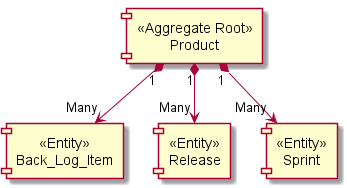
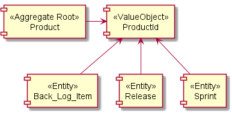

### Aggregates 

- Clustering entities and value objects into an aggregate with a carefully crafted consistency boundary may at first seem like quick work, but among all [DDD] tactical guidance, this pattern is one of the least well understood.
- To start off, it might help to consider some common questions.
    - Is an aggregate just a way to cluster a graph of closely related objects under a common parent? 
    - If so, is there some practical limit to the number of objects that should be allowed to reside in the graph? 
    - Since one aggregate instance can reference other aggregate instances, can the associations be navigated deeply, modifying various objects along the way? 
    - And what is this concept of invariants and a consistency boundary all about? 
    - It is the answer to this last question that greatly influences the answers to the others.
- There are various ways to model aggregates incorrectly.
    - We could fall into the trap of designing for compositional convenience and make them too large. 
    - At the other end of the spectrum we could strip all aggregates bare, and as a result fail to protect true invariants. 
    - As we'll see, it's imperative that we avoid both extremes and instead pay attention to the business rules.


#### Designing a Scrum Management Application   

- The best way to explain aggregates is with an example.
    - Our fictitious company is developing an application to support Scrum-based projects, ProjectOvation. 
    - It follows the traditional Scrum project management model, complete with product, product owner, team, backlog items, planned releases, and sprints. 
    - If you think of Scrum at its richest, that's where ProjectOvation is headed. 
    - This provides a familiar domain to most of us. 
    - The Scrum terminology forms the starting point of the ubiquitous language. 
    - It is a subscription-based application hosted using the software as a service (SaaS) model. 
    - Each subscribing organization is registered as a tenant, another term for our ubiquitous language.
- The company has assembled a group of talented Scrum experts and Java developers.
    - However, their experience with DDD is somewhat limited. 
    - That means the team is going to make some mistakes with DDD as they climb a difficult learning curve. 
    - They will grow, and so can we. 
    - Their struggles may help us recognize and change similar unfavorable situations we've created in our own software.
- The concepts of this domain, along with its performance and scalability requirements, are more complex than any of them have previously faced. 
    - To address these issues, one of the DDD tactical tools that they will employ is aggregate.
    - How should the team choose the best object clusters? 
    - The aggregate pattern discusses composition and alludes to information hiding, which they understand how to achieve. 
    - It also discusses consistency boundaries and transactions, but they haven't been overly concerned with that. 
    - Their chosen persistence mechanism will help manage atomic commits of their data. 
    - However, that was a crucial misunderstanding of the pattern's guidance that caused them to regress. 
    - Here's what happened. 
    - The team considered the following statements in the ubiquitous language
       - Products have backlog items, releases, and sprints.
       - New product backlog items are planned.
       - New product releases are scheduled.
       - New product sprints are scheduled.
       - A planned backlog item may be scheduled for release.
       - A scheduled backlog item may be committed to a sprint.    
    - From these they envisioned a model, and made their first attempt at a design.    
    
#### First Attempt: Large-Cluster Aggregate
- The team put a lot of weight on the words “Products have” in the first statement. 
- It sounded to some like composition, that objects needed to be interconnected like an object graph. 
- Maintaining these object life cycles together was considered very important. 
- So, the developers added the following consistency rules into the specification:
  - If a backlog item is committed to a sprint, we must not allow it to be removed from the system.
  - If a sprint has committed backlog items, we must not allow it to be removed from the system.
  - If a release has scheduled backlog items, we must not allow it to be removed from the system.
  - If a backlog item is scheduled for release, we must not allow it to be removed from the system.
- As a result, Product was first modeled as a very large aggregate.
- The root object, Product, held all Backlog Item, all Release, and all Sprint instances associated with it. 
- The interface design protected all parts from inadvertent client removal. 

##### This design is shown in the following code

```java
public class Product extends ConcurrencySafeEntity {
    private Set<BacklogItem> backlogItems;
    private String description;
    private String name;
    private ProductId productId;
    private Set<Release> releases;
    private Set<Sprint> sprints;
    private TenantId tenantId;
    ...
}
``` 

|  |   |  | 

|  | Product modeled as a very large aggregate.  |  | 

- The big aggregate looked attractive, but it wasn't truly practical. 
    - Once the application was running in its intended multi-user environment it began to regularly experience transactional failures. 
    - Let's look more closely at a few client usage patterns and how they interact with our technical solution model. 
    - Our aggregate instances employ optimistic concurrency to protect persistent objects from simultaneous overlapping modifications by different clients, thus avoiding the use of database locks. 
    - Objects carry a version number that is incremented when changes are made and checked before they are saved to the database. 
    - If the version on the persisted object is greater than the version on the client's copy, the client's is considered stale and updates are rejected.
    - Consider a common simultaneous, multi-client usage scenario:
        - Two users, Bill and Joe, view the same Product marked as version 1, and begin to work on it.
        - Bill plans a new BacklogItem and commits. 
            ```diff
            - + The Product version is incremented to 2.
            ```
        - Joe schedules a new Release and tries to save, 
            ```diff
            - - but his commit fails because it was based on Product version 1.
            ```    
    - Persistence mechanisms are used in this general way to deal with concurrency.
    - If you argue that the default concurrency configurations can be changed, reserve your verdict for a while longer. 
    - This approach is actually important to protecting aggregate invariants from concurrent changes.
    - These consistency problems came up with just two users. 
        - Add more users, and this becomes a really big problem.
        - With Scrum, multiple users often make these kinds of overlapping modifications during the sprint planning meeting and in sprint execution. 
        - Failing all but one of their requests on an ongoing basis is completely unacceptable.
        - Nothing about planning a new backlog item should logically interfere with scheduling a new release! 
        - Why did Joe's commit fail? 
        - At the heart of the issue, the large cluster aggregate was designed with false invariants in mind, not real business rules. 
        - These false invariants are artificial constraints imposed by developers. 
        - There are other ways for the team to prevent inappropriate removal without being arbitrarily restrictive. 
        - Besides causing transactional issues, the design also has performance and scalability drawbacks.   
        
#### Second Attempt: Multiple Aggregates      

- Now consider an alternative model as shown in Figure 2, in which we have four distinct aggregates. 
    - Each of the dependencies is associated by inference using a common ProductId, 
        - which is the identity of Product considered the parent of the other three.   
        
|  |   |  | 

|  | Product and related concepts are modeled as separate aggregate types.  |  |     

- Breaking the large aggregate into four will change some method contracts on Product. 
- With the large cluster aggregate design the method signatures looked like this: 
```java
    public class Product{
        
        public void planBacklogItem(
            String aSummary, String aCategory,
            BacklogItemType aType, StoryPoints aStoryPoints) {
        }
        
        public void scheduleRelease(
            String aName, String aDescription,
            Date aBegins, Date anEnds) {
        }
        public void scheduleSprint(
            String aName, String aGoals,
            Date aBegins, Date anEnds) {
        }    
    }
``` 

- All of these methods are [CQS] commands. That is, they modify the state of the Product by adding the new element to a collection, so they have a void return type. 
    -But with the multiple aggregate design, we have:
```java
    public class Product{
        
        public BacklogItem planBacklogItem(
            String aSummary, String aCategory,
            BacklogItemType aType, StoryPoints aStoryPoints) {
        }
        
        public Release scheduleRelease(
            String aName, String aDescription,
            Date aBegins, Date anEnds) {
        }
        public Sprint scheduleSprint(
            String aName, String aGoals,
            Date aBegins, Date anEnds) {
        }    
    }
```     

- These redesigned methods have a [CQS] query contract, and act as factories. 
    - That is, they each respectively create a new aggregate instance and return a reference to it. 
    - Now when a client wants to plan a backlog item, the transactional application service must do the following:

```java
    
    public class ProductBacklogItemService  {
    
        @Transactional
        public void planProductBacklogItem(
            String aTenantId, String aProductId,
            String aSummary, String aCategory,
            String aBacklogItemType, String aStoryPoints) {
                Product product =
                productRepository.productOfId(
                new TenantId(aTenantId),
                new ProductId(aProductId));
                BacklogItem plannedBacklogItem =
                product.planBacklogItem(
                aSummary,
                aCategory,
                BacklogItemType.valueOf(aBacklogItemType),
                StoryPoints.valueOf(aStoryPoints));
                backlogItemRepository.add(plannedBacklogItem);
        }
        
    } 
```     

- So we've solved the transaction failure issue by modeling it away. 
    - Any number of BacklogItem, Release, and Sprint instances can now be safely created by simultaneous user requests. 
    - That's pretty simple.
    - However, even with clear transactional advantages, the four smaller aggregates are less convenient from the perspective of client consumption. 
    - Perhaps instead we could tune the large aggregate to eliminate the concurrency issues. 
    - By setting our Hibernate mapping optimistic-lock option to false, the transaction failure domino effect goes away. 
    - There is no invariant on the total number of created BacklogItem, Release, or Sprint instances, so why not just allow the collections to grow unbounded and ignore these specific modifications on Product? 
    - What additional cost would there be in keeping the large cluster aggregate?
    - The problem is that it could actually grow out of control. 
    - Before thoroughly examining why, let's consider the most important modeling tip the team needed.

- **Rule: Model True Invariants In Consistency Boundaries**
    - When trying to discover the aggregates in a bounded context, we must understand the model's true invariants. 
    - Only with that knowledge can we determine which objects should be clustered into a given aggregate.
    - An invariant is a business rule that must always be consistent.
    - There are different kinds of consistency. 
    - One is transactional, which is considered immediate and atomic. 
    - There is also eventual consistency. 
    - When discussing invariants, we are referring to transactional consistency. 
    - We might have the invariant:
        - c = a + b
    - Therefore, when a is 2 and b is 3, c must be 5. 
    - According to that rule and conditions, if c is anything but 5, a system invariant is violated. 
    - To ensure that c is consistent, we model a boundary around these specific attributes of the model:
    
```java
    
    AggregateType1 {
        int a; int b; int c;
        operations...
    }

```

- The consistency boundary logically asserts that everything inside adheres to a specific set of business invariant rules no matter what operations are performed. 
- The consistency of everything outside this boundary is irrelevant to the aggregate.
- Thus, aggregate is synonymous with transactional consistency boundary. (In this limited example, AggregateType1 has three attributes of type int, but any given aggregate could hold attributes of various types.)
      