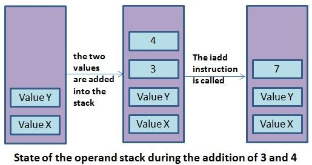
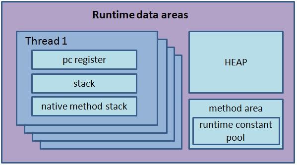
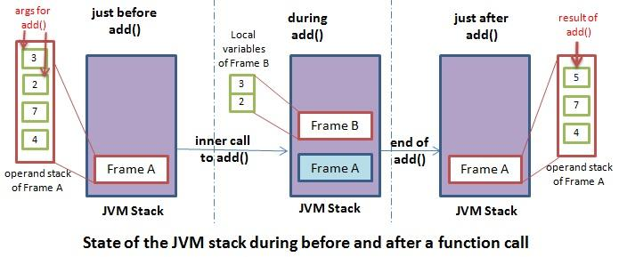

- JAVA is famous for WOTA: “write once, run anywhere”. 
- In order to apply it, Sun Microsystems created the Java Virtual Machine, an abstraction of the underlying OS that interprets compiled java code. 
- The JVM is the core component of the JRE (Java Runtime Environment) and was created to run Java code but is now used by other languages.

## Global Overview
- The JVM is an abstraction of the underlying OS. It ensures that the same code will run with the same behavior no matter what hardware or OS the JVM is running on. For example:
    - The size of the primitive type int will always be a 32-bit signed integer from -2^31 to 2^31-1 whether the JVM is running on a 16bit/32bit/64bit OS.
    - Each JVM stores and uses data in-memory in a big-endian order (where high bytes come first) whether the underlying OS/Hardware is big-endian or little endian.
    - Note: sometimes, the behavior of a JVM implementation differs from another one but it’s generally the same.
        -  

- The JVM interprets bytecode which is produced by the compilation of the source code of a class. Though the term JVM stands for “Java Virtual Machine”, it runs other languages like scala or groovy, as long as they can be compiled into java bytecode.
- In order to avoid disk I/O, the bytecode is loaded into the JVM by classloaders in one of the the runtime data areas. This code stays in memory until the JVM is stopped or the classloader (that loaded it) is destroyed.
- The loaded code is then interpreted and executed by an execution engine.
- The execution engine needs to store data like a pointer to the ligne of code being executed. It also needs to store the data handled in the developer’s code.
- The execution engine also takes care of dealing with the underlying OS.
- Instead of always interpreting bytecode, the execution engine of many JVM implementations compiles the bytecode into native code if it’s often used. 
    - It’s called the Just In Time (JIT) compilation and greatly speeds up the JVM. 
    - The compiled code is temporary kept in a zone often called Code Cache.

## Stack based architecture

- The JVM uses a stack based architecture. 
- The JVM executes the developer’s code by executing basics operations described in the Java bytecode. 
    - An operand is a value on which an instruction operates. 
    - According to the JVM specifications, those operations require that the parameters are passed through a stack called the operand stack.
        -       

- For example, let’s take the basic addition of 2 integers. 
    - This operation is called iadd (for integer addition). 
    - If one wants to add 3 and 4 in bytecode:
        - He first pushes 3 and 4 in the operand stack.
        - Then calls the iadd instruction.
        - The iadd will pop the last 2 values from the operand stack.
        - The int result (3 + 4) is pushed into the operand stack in order to be used by other operations.
        - This way of functioning is called stack based architecture. 
            - There are other ways to deal with basics operations, 
            - for example the register based architecture stores the operands in small registers instead of a stack. 
            - This register based architecture is used by desktop/server (x86) processors.
            
## Bytecode
- Since the JVM interprets bytecode it’s useful to understand what it is before going deeper.
- The java bytecode is the java source code transformed into a set of basic operations. Each operation is composed by one byte that represents the instruction to execute (called opcode or operation code), along with zero or more bytes for passing parameters (but most of the operation uses the operand stack to pass parameters). Of the 256 possible one byte-long opcodes (from value 0x00 to 0xFF in hexadecimal), 204 are currently in use in the java8 specifications.
- Here is a list of the different category of bytecode operations. For each category, I added a small description and the hexadecimal range of the operation codes:
    - Constants: for pushing values from the constant pool (we’ll see it later) or from known values into the operand stack. From value 0x00 to 0x14
    - Loads: for loading values from local variables into the operand stack. From value 0x15 to 0x35
    - Stores: for storing from the operand stack into local variables. From value 0x36 to 0x56
    - Stack: for handling the operand stack. From value 0x57 to 0x5f
    - Math: for basic mathematical operations on values from the operand stack. From value 0x60 to 0x84
    - Conversions: for converting from one type to another. From value 0x85 to 0x93
    - Comparisons: for basic comparison between two values. From value 0x94 to 0xa6
    - Control: the basics operations like goto, return, … that allows more advanced operation like loops or functions that return values. From value 0xa7 to 0xb1
    - References: for allocating objects or arrays, getting or checking references on objects, method or static methods. Also used for invoking (static) methods. From value 0xb2 to 0xc3
    - Extended: operations from the others categories that were added after. From value 0xc4 to 0xc9
    - Reserved: for internal use by each Java Virtual Machine implementation. 3 values: 0xca, 0xfe and 0xff.
- These 204 operations are very simple, for example:
    - The operand ifeq (0x99 ) checks if 2 values are equals
    - The operand iadd (0x60) adds 2 values
    - The operand i2l (0x85) converts an integer to a long
    - The operand arraylength (0xbe)  gives the size of an array
    - The operand pop (0x57) pops the first value from the operand stack
- To create bytecode one needs a compiler, the standard java compiler included in the JDK is javac.
- Let’s have a look of a simple addition:     
```java
public class Test {
  public static void main(String[] args) {
    int a =1;
    int b = 15;
    int result = add(a,b);
  }
 
  public static int add(int a, int b){
    int result = a + b;
    return result;
  }
}
```       
- The “javac Test.java” command generates a bytecode in Test.class. Since the java bytecode is a binary code, it’s not readable by humans. Oracle provides a tool in its JDK,  javap, that transforms binary bytecode into human readable set of labeled operation codes from the JVM specifications.
- The command “javap -verbose Test.class” gives the following result :
```java
Classfile /C:/TMP/Test.class
  Last modified 1 avr. 2015; size 367 bytes
  MD5 checksum adb9ff75f12fc6ce1cdde22a9c4c7426
  Compiled from "Test.java"
public class com.codinggeek.jvm.Test
  SourceFile: "Test.java"
  minor version: 0
  major version: 51
  flags: ACC_PUBLIC, ACC_SUPER
Constant pool:
   #1 = Methodref          #4.#15         //  java/lang/Object."<init>":()V
   #2 = Methodref          #3.#16         //  com/codinggeek/jvm/Test.add:(II)I
   #3 = Class              #17            //  com/codinggeek/jvm/Test
   #4 = Class              #18            //  java/lang/Object
   #5 = Utf8               <init>
   #6 = Utf8               ()V
   #7 = Utf8               Code
   #8 = Utf8               LineNumberTable
   #9 = Utf8               main
  #10 = Utf8               ([Ljava/lang/String;)V
  #11 = Utf8               add
  #12 = Utf8               (II)I
  #13 = Utf8               SourceFile
  #14 = Utf8               Test.java
  #15 = NameAndType        #5:#6          //  "<init>":()V
  #16 = NameAndType        #11:#12        //  add:(II)I
  #17 = Utf8               com/codinggeek/jvm/Test
  #18 = Utf8               java/lang/Object
{
  public com.codinggeek.jvm.Test();
    flags: ACC_PUBLIC
    Code:
      stack=1, locals=1, args_size=1
         0: aload_0
         1: invokespecial #1                  // Method java/lang/Object."<init>":()V
         4: return
      LineNumberTable:
        line 3: 0
 
  public static void main(java.lang.String[]);
    flags: ACC_PUBLIC, ACC_STATIC
    Code:
      stack=2, locals=4, args_size=1
         0: iconst_1
         1: istore_1
         2: bipush        15
         4: istore_2
         5: iload_1
         6: iload_2
         7: invokestatic  #2                  // Method add:(II)I
        10: istore_3
        11: return
      LineNumberTable:
        line 6: 0
        line 7: 2
        line 8: 5
        line 9: 11
 
  public static int add(int, int);
    flags: ACC_PUBLIC, ACC_STATIC
    Code:
      stack=2, locals=3, args_size=2
         0: iload_0
         1: iload_1
         2: iadd
         3: istore_2
         4: iload_2
         5: ireturn
      LineNumberTable:
        line 12: 0
        line 13: 4
}
```     

- The readable .class shows that the bytecode contains more than a simple transcription of the java source code. It contains:
    - the description of the constant pool of the class. The constant pool is one of the data areas of the JVM that stores metadata about classes like the name of the methods, their arguments …When a class is loaded inside the JVM this part goes into the constant pool.
    - Information like LineNumberTable  or LocalVariableTable that specify the location (in bytes) of the function and their variables in the bytecode.
    - A transcription in bytecode of the developer’s java code (plus the hidden constructor).
    - Specific operations that handle the operand stack and more broadly the way of passing and getting parameters.
    
FYI, here is a light description of the information stored in a .class file:
```java 
ClassFile {
  u4 magic;
  u2 minor_version;
  u2 major_version;
  u2 constant_pool_count;
  cp_info constant_pool[constant_pool_count-1];
  u2 access_flags;
  u2 this_class;
  u2 super_class;
  u2 interfaces_count;
  u2 interfaces[interfaces_count];
  u2 fields_count;
  field_info fields[fields_count];
  u2 methods_count;
  method_info methods[methods_count];
  u2 attributes_count;
  attribute_info attributes[attributes_count];
}
```     

## Runtime Data Areas

- The runtime data areas are the in-memory areas designed to store data. 
    - Those data are used by the developer’s program or by the JVM for its inner working.
    -  


## Heap
- The heap is a memory area shared among all Java Virtual Machine Threads. It is created on virtual machine start-up. All class instances and arrays are allocated in the heap (with the new operator).
``` java 
MyClass myVariable = new MyClass();
MyClass[] myArrayClass = new MyClass[1024];
```

- This zone must be managed by a garbage collector to remove the instances allocated by the developer when they are not used anymore. The strategy for cleaning the memory is up to the JVM implementation (for example, Oracle Hotspot provides multiple algorithms).
- The heap can be dynamically expanded or contracted and can have a fixed minimum and maximum size. For example, in Oracle Hotspot, the user can specify the minimum size of the heap with the Xms and Xmx parameters by the following way “java -Xms=512m -Xmx=1024m …”
- Note: There is a maximum size that the heap can’t exceed. If this limit is exceeded the JVM throws an OutOfMemoryError.

## Method area
- The Method area is a memory shared among all Java Virtual Machine Threads. It is created on virtual machine start-up and is loaded by classloaders from bytecode. The data in the Method Area stay in memory as long as the classloader which loaded them is alive.
- The method area stores:
    - class information (number of fields/methods, super class name, interfaces names, version, …)
    - the bytecode of methods and constructors.
    - a runtime constant pool per class loaded.
- The specifications don’t force to implement the method area in the heap. 
    - For example, until JAVA7, Oracle HotSpot used a zone called PermGen to store the Method Area. 
    - This PermGen was contiguous with the Java heap (and memory managed by the JVM like the heap) and was limited to a default space of 64Mo (modified by the argument -XX:MaxPermSize). 
    - Since Java 8, HotSpot now stores the Method Area in a separated native memory space called the Metaspace, the max available space is the total available system memory.
- Note: There is a maximum size that the method area can’t exceed. If this limit is exceeded the JVM throws an OutOfMemoryError.

## Runtime constant pool
- This pool is a subpart of the Method Area. Since it’s an important part of the metadata, Oracle specifications describe the Runtime constant pool apart from the Method Areas. This constant pool is increased for each loaded class/interface. This pool is like a symbol table for a conventional programming language. In other words, when a class, method or field is referred to, the JVM searches the actual address in the memory by using the runtime constant pool. It also contains constant values like string litterals or constant primitives.
``` java
String myString1 = “This is a string litteral”;
static final int MY_CONSTANT=2;
```  

## The pc Register (Per Thread)
- Each thread has its own pc (program counter) register, created at the same time as the thread. At any point, each Java Virtual Machine thread is executing the code of a single method, namely the current method for that thread. The pc register contains the address of the Java Virtual Machine instruction (in the method area) currently being executed.
- Note: If the method currently being executed by the thread is native, the value of the Java Virtual Machine’s pc register is undefined.The Java Virtual Machine’s pc register is wide enough to hold a returnAddress or a native pointer on the specific platform.

 

## Java Virtual Machine Stacks (Per Thread)
- The stack area stores multiples frames.

## Frames
- A frame is a data structure that contains multiples data that represent the state of the thread in the current method (the method being called):
    - Operand Stack: I’ve already presented the operand stack in the chapter about stack based architecture. This stack is used by the bytecode instructions for handling parameters. This stack is also used to pass parameters in a (java) method call and to get the result of the called method at the top of the stack of the calling method.
    - Local variable array: This array contains all the local variables in a scope of the current method. This array can hold values of primitive types, reference, or returnAddress. The size of this array is computed at compilation time. The Java Virtual Machine uses local variables to pass parameters on method invocation, the array of the called method is created from the operand stack of the calling method.
    - Run-time constant pool reference: reference to the constant pool of the current class of the current method being executed. It is used by the JVM to translate symbolic method/variable reference ( ex: myInstance.method()) to the real memory reference.

## Stack
- Each Java Virtual Machine thread has a private Java Virtual Machine stack, created at the same time as the thread. A Java Virtual Machine stack stores frames. A new frame is created and put in the stack each time a method is invoked. A frame is destroyed when its method invocation completes, whether that completion is normal or abrupt (it throws an uncaught exception).
- Only one frame, the frame for the executing method, is active at any point in a given thread. This frame is referred to as the current frame, and its method is known as the current method. The class in which the current method is defined is the current class. Operations on local variables and the operand stack are typically with reference to the current frame.     
- Let’s look at the following example which is a simple addition
``` java
public int add(int a, int b){
  return a + b;
}
 
public void functionA(){
// some code without function call
  int result = add(2,3); //call to function B
// some code without function call
}
```    
- Here is how it works inside the JVM when the functionA() is running on:
    -  
    - Inside functionA() the Frame A is the top of the stack frame and is the current frame. At the beginning of the inner call to add () a new frame (Frame B) is put inside the Stack. Frame B becomes the current frame. The local variable array of frame B is populated from popping the operand stack of frame A. When add() finished, Frame B is destroyed and Frame A becomes again the current frame. The result of add() is put on the operand stack of Frame A so that functionA() can use it by popping its operand stack.
    - Note: the functioning of this stack makes it dynamically expandable and contractable. There is a maximum size that a stack can’t exceed, which limit the number of recursive calls. If this limit is exceeded the JVM throws a StackOverflowError.
    - With Oracle HotSpot, you can specify this limit with the parameter -Xss.

## Native method stack (Per Thread)
- This is a stack for native code written in a language other than Java and called through JNI (Java Native Interface).  Since it’s a “native” stack, the behavior of this stack is entirely dependent of the underlying OS.
  
       
  
       